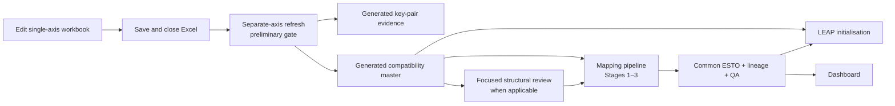

# leap_mappings

This repo is the active home for LEAP / ESTO / 9th Outlook mapping maintenance. It keeps the human mapping task simple while letting scripts generate the more complex relationship tables, common-denominator ESTO structures, and QA outputs needed for fair comparisons.

New to the connected mappings, LEAP-initialisation, and dashboard system? Start
with the compact [`docs/start_here.md`](docs/start_here.md). Continue to the
connected-system [`handover overview`](docs/handover/README.md), then the
[`end-to-end system guide`](docs/handover/end_to_end_system_guide.md); agents
should use the
[`operations guide`](docs/handover/agent_operations_guide.md).

Researchers maintain the simple axis sheets in
`config/outlook_mappings_single_axis.xlsx`, such as:

- `leap_sector_to_esto` and `leap_fuel_to_esto`;
- `leap_sector_to_ninth` and `leap_fuel_to_ninth`; and
- `ninth_sector_to_esto` and `ninth_fuel_to_esto`.

The three combined pair sheets in `config/outlook_mappings_master.xlsx` are
generated compatibility outputs and should not be edited.

The core idea is that people edit simple rows:

```text
source row -> target row/component
include/exclude
notes
```

Scripts then generate the structured outputs used by comparison tools and dashboards.

The separate-axis refresh is the preliminary production gate, not an optional
side workflow. Run it before Stage 1 whenever an axis, accepted exact pair,
exception, or rollup changes.



## Layered Workflow

1. Maintain mapping semantics in
   `config/outlook_mappings_single_axis.xlsx`, then run
   `codebase/separate_axis_mapping_refresh_workflow.py` to regenerate pair
   authority and the canonical compatibility workbook. This is the first
   production step after a mapping-contract edit.

2. Review changed structural inputs when needed:
   - `codebase/hierarchy_subtotal_contract_workflow.py` for hierarchy/subtotal
     evidence and exact-cell workbook review
   - `codebase/missing_mapped_esto_rows_workflow.py` for reviewed ESTO source
     rows that are still missing
   - both workflows are review-only; the production pipeline starts with the
     separate-axis refresh above, then Stage 1

3. Run Stage 1 to generate canonical relationship rows from
   `config/outlook_mappings_master.xlsx`:
   - `codebase/mapping_tools/build_energy_balance_relationships.py`
   - output: `results/mapping_relationships/energy_balance_relationships.csv`
   - output: `results/mapping_relationships/energy_balance_relationships.xlsx`

4. Run Stage 2 to build automatic common ESTO rows:
   - `codebase/mapping_tools/build_common_esto_structure.py`
   - output: `results/common_esto/common_esto_rows.csv` (the small
     human-readable row catalogue)
   - output: `results/common_esto/esto_to_common_esto_map.csv`

5. Run conversion and Stage 3 to apply the common structure to ESTO-shaped data:
   - `codebase/mapping_tools/apply_common_esto_structure.py`
   - production output:
     `results/common_esto/common_esto_comparison_data.parquet`, with its
     adjacent manifest
   - selected small review/catalogue outputs remain CSV; large machine-only
     diagnostics and anchor tables are manifested Parquet+Zstandard

The dashboard should use common ESTO comparison data, not raw LEAP rows, raw 9th rows, or `relationship_id -> graph_id` links. `dashboard_chart` should not be treated as a required mapping use case.

## Common ESTO Structure

The common ESTO structure is generated as a graph/partition problem. Exact ESTO flow/product pairs are nodes. If a LEAP or 9th source row maps to multiple ESTO components, those components get connected and must stay together for comparison scopes that include that source.

This protects the main rule:

```text
Do not split a source aggregate unless there is an explicit allocation method.
```

If all sources can support exact ESTO detail, the row stays exact. If one source is coarser, other sources are rolled up to the common denominator.

Common row labels are mechanical:

```text
compressed component codes + nearest useful parent name
```

For example:

```text
07.12-07.17,07.99 Petroleum products
```

Label overrides can improve display names, but they should not change component membership.

## QA Philosophy

The generated QA outputs are as important as the final comparison table. They should show:

- missing or duplicate exact ESTO components;
- source aggregates split across common rows;
- rollup explanations;
- unresolved partial coverage;
- total preservation checks;
- broad or intersecting aggregate groups for review.

The system should usually resolve detail mismatches by rolling up. Final comparison outputs use a mapped-universe policy: rows outside the common structure are written to diagnostics, while mapped rows must preserve totals. Broad rows and parent/detail overlaps are review signals rather than blockers when mapped-universe totals and subtotal/tree validation pass.

## Current Inputs

- `config/outlook_mappings_single_axis.xlsx`
- `config/outlook_mappings_key_pairs_generated.xlsx`
- `config/outlook_mappings_master.xlsx`
- `data/00APEC_2025_low_with_subtotals.csv`
- `data/merged_file_energy_ALL_20251106.csv`
- `data/leap balances exports/`

Raw LEAP balance exports are owned by the sibling `leap_initialisation` repo at
`../leap_initialisation/data/leap balances exports/`. Mapping outputs are written
to this repository's `results/`; the local path above is legacy/reference only
and is not selected by the pipeline. Set `LEAP_BALANCE_EXPORTS_ROOT` only for a
non-standard checkout layout.

`config/master_config.xlsx` is a legacy reference workbook.
`config/leap_mappings.xlsx` is a retired legacy filename and is not present in
the current checkout. New pair semantics belong in
`config/outlook_mappings_single_axis.xlsx`; existing consumers continue to use
the generated `config/outlook_mappings_master.xlsx` interface.

Run notebook-style from the repo root, following `AGENTS.md`.

## Finding Your Way Around `results/`

The pipeline writes a lot into `results/`. Start with `results/README.md` — it points to the
handful of primary outputs and links to a short guide for each subfolder. See
`docs/results_folder_cleanup_candidates.md` for known clutter/orphaned files flagged for future
cleanup (not yet actioned), and `docs/repo_data_slimdown_plan.md` for which `config/`/`data/`
files are actually required to run the pipeline.

## Finding Your Way Around `codebase/`

`codebase/` mixes the live pipeline with standalone maintenance tools, a legacy
refresh workflow, dashboard-prototype code that belongs in the sibling
`leap_dashboard` repository, and retained scripts with known limitations. See
`docs/workflow_inventory.md` for the maintained status of each entry point;
location under `codebase/` alone does not make a script part of the active
pipeline.

## Finding Your Way Around the Rest of the Repo

`config/README.md` and `data/README.md` explain what's required to run the pipeline vs. legacy,
right there in each folder. `docs/README.md` indexes every file under `docs/` so you don't have
to open all of them to find the one you need.

## Detailed documentation

The earlier improvement list for this README has been completed in the
layered handover set: pipeline diagrams, comparison-scope definitions,
validation severity, a worked USA natural-gas example, and a glossary are in
[`docs/handover/README.md`](docs/handover/README.md) and
[`docs/handover/end_to_end_system_guide.md`](docs/handover/end_to_end_system_guide.md).
Keep this root page concise and maintain the detail there.
