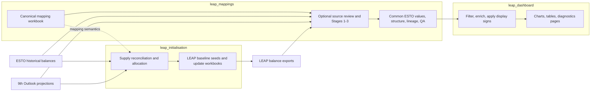
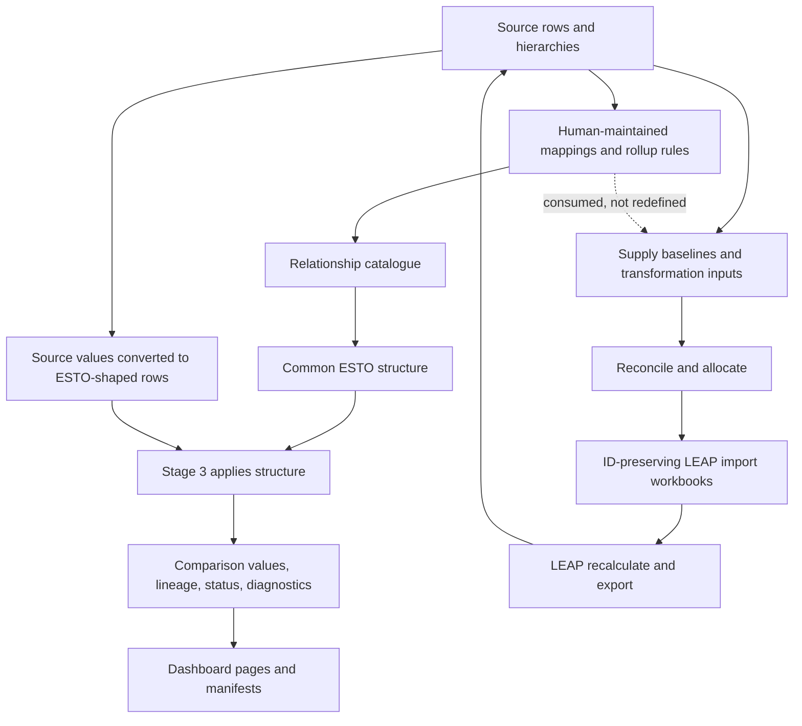
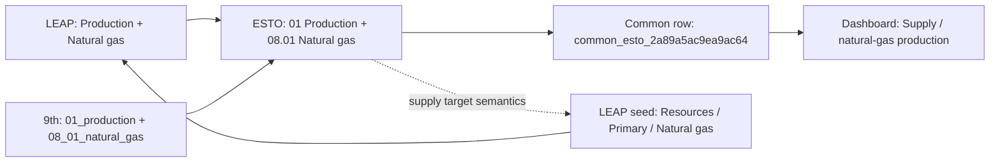

# LEAP mappings, initialisation, and dashboard: connected-system overview

**Evidence snapshot:** 2026-07-28

**Audience:** new staff, reviewers, and project managers
**System owner for this index:** `leap_mappings`

**Documentation level:** Level 1 connected-system overview

For the two-minute ownership and navigation route, begin with
[`../start_here.md`](../start_here.md). This page is the deeper system
orientation; it does not replace the canonical technical references linked
below.

This three-repository system turns ESTO historical balances, 9th Outlook
projections, and LEAP model results into:

1. a shared Common ESTO comparison dataset;
2. reconciled, ID-preserving workbooks that can be imported into LEAP; and
3. economy dashboards that show the resulting comparisons and their diagnostic
   health.

The important boundary is simple: **mapping meaning is decided in
`leap_mappings`; LEAP model preparation is performed in `leap_initialisation`;
presentation is performed in `leap_dashboard`.**

## The system in one picture

The arrows are not one single automated job. Initialisation includes a manual
LEAP import, recalculation, and re-export loop. Mapping candidates and modelling
decisions also require human review.

## What problem this solves

ESTO, the 9th Outlook, and LEAP describe the same energy system with different
hierarchies, names, and levels of detail. Directly comparing their rows can
double count subtotals or compare unlike categories. The mapping pipeline
constructs a reviewed common denominator. The initialisation workflow then
uses historical and projected energy balances to prepare LEAP consistently.
The dashboard presents comparisons without redefining the mappings.

## Repository responsibilities

| Repository | Defines | Executes | Principal outputs | Does not own |
|---|---|---|---|---|
| `leap_mappings` | Mapping rows, rollups, comparison scopes, Common ESTO membership | optional hierarchy/source review and Stages 1–3 | relationships, Common ESTO structure/values, lineage, mapping QA | LEAP import IDs; dashboard page design |
| `leap_initialisation` | Reconciliation, allocation, caps, LEAP preparation rules | baseline-seed, results-update, patch, validation, workbook generation | LEAP-ready workbooks, balance tables, reconciliation and readiness diagnostics | mapping semantics; dashboard presentation |
| `leap_dashboard` | Page routing, visible series, display signs, chart/table layout, publication gates | ingest, filter, enrich, render, diagnose, publish | HTML/JS pages, chart manifest, page and sign summaries | source-to-target mappings; LEAP preparation |

For exact producer/consumer boundaries, see
[Cross-repository data contracts](cross_repository_data_contracts.md).

## Which repository should I use?

| Need | Use | First evidence to inspect |
|---|---|---|
| Change or review a LEAP/ESTO/9th relationship | `leap_mappings` | `config/outlook_mappings_single_axis_prototype.xlsx`, `docs/separate_axis_mapping_pipeline.md`, and `docs/mappings_system.md`; the old master remains production until promotion |
| Add an ESTO Extended category | `leap_mappings` | `docs/esto_extended_category_creation_considerations.md` |
| Investigate Stage 3 totals, rollups, missing rows, or lineage | `leap_mappings` | `results/common_esto/common_esto_output_status.csv` |
| Create or repair baseline seeds and LEAP imports | `leap_initialisation` | `docs/supply_reconciliation_workflow_guide.md` |
| Diagnose unresolved LEAP IDs or branch paths | `leap_initialisation` | export-readiness findings and the economy template |
| Change page placement, chart layout, display colours, or sign wording | `leap_dashboard` | `config/common_esto_dashboard/` and `chart_manifest.csv` |
| A mapped row exists but no dashboard page accepts it | joint | mapping component membership first; dashboard routing second |
| Accept a generated mapping candidate | human review in `leap_mappings` | source evidence, sibling coverage, hierarchy, and cardinality |

## Normal execution order

1. Refresh ESTO, 9th Outlook, LEAP balance exports, or LEAP templates only when
   their source changed.
2. Close the mapping workbooks in Excel.
3. Refresh the separate-axis compatibility master when its axes, accepted
   pairs, evidence sources, or rollup rules changed.
4. If hierarchy evidence or reviewed ESTO source-row requirements changed, run
   the applicable focused review workflow. Then run mapping Stages 1–3 against
   the selected canonical or isolated shadow workbook.
5. Inspect `common_esto_output_status.csv`, the Stage 3 manifest, and relevant
   failed/review diagnostics. “Completed” means the process finished; it does
   not mean every validation passed.
6. Run initialisation when LEAP seeds or reconciliation must change. Validate
   generated workbooks before importing.
7. Import into LEAP, recalculate, export results, and repeat results-update
   reconciliation until gaps are small and explained.
8. Render the dashboard from the reviewed Common ESTO outputs.
9. Run dashboard publication-readiness and page-noise checks before publishing.

Mapping and initialisation are partly independent: both use ESTO, 9th Outlook,
and the canonical mapping workbook, but Common ESTO Stage 3 is not an input to
the seed generator. The dashboard depends directly on Stage 3.

## What always requires human review

- Generated mapping candidates. They are suggestions, never automatic workbook
  edits.
- New ESTO Extended categories and any allocation of value into them.
- Subtotal/leaf mismatches, many-to-many relationships, sibling coverage, and
  deliberately absent mappings.
- Reconciliation policies such as caps, surplus handling, import fallback, and
  whether an economy-specific result is physically plausible.
- Missing or `-1` LEAP IDs, template differences, and model-structure changes.
- Failed, skipped, missing, or stale validations before release.
- Dashboard publication, especially empty charts or unplaced categories.

Never infer subtotal meaning from a label, restore a removed mapping merely
because it is absent, or move mapping logic into dashboard configuration.

## A real row: USA natural-gas production

This example was read from the current 2026-07-28 workbook and outputs.

1. The canonical workbook maps LEAP `Production` + `Natural gas` to ESTO
   `01 Production` + `08.01 Natural gas`. It independently maps 9th
   `01_production` + `08_01_natural_gas` to the same ESTO pair.
2. Stage 1 emits relationship IDs `rel_f0097e201a8e745b` (LEAP) and
   `rel_2f600a8fcf83fe69` (9th).
3. Stage 2 resolves the exact row
   `common_esto_2a89a5ac9ea9ac64`; it is not a rollup.
4. Stage 3 records 2022 USA values of 35,785.34633 PJ for ESTO and
   35,785.34632 PJ for LEAP/9th, with the tiny difference retained rather than
   hidden.
5. The latest baseline-seed artifact writes
   `Resources\Primary\Natural gas` / `Maximum Production`, preserving
   `BranchID=832` and `VariableID=801`. Its 2030 Reference expression contains
   44,529.523416 PJ, matching the Reference series used by Stage 3.
6. The dashboard manifest routes the exact pair to the Supply page as
   `chart__line__01_production__08_01_natural_gas` and explains positive values
   as domestic production added to supply.

The dotted arrow matters: initialisation consumes the same mapping meaning, but
it does not consume the dashboard’s rendered data.

## Glossary

| Term | Meaning |
|---|---|
| ESTO | Historical APEC energy-balance dataset, organised by flow and product |
| 9th Outlook | APERC projection dataset, organised by sector and fuel, with Reference and Target scenarios |
| LEAP | Energy modelling application and model areas being initialised and compared |
| mapping pair | A flow/product or sector/fuel combination treated as one source category |
| relationship | A Stage 1 source-to-target mapping record, including use case and status |
| Common ESTO | Generated common comparison structure whose components are ESTO pairs |
| exact row | A Common ESTO row containing one exact ESTO flow/product component |
| generated row | A common row constructed from more than one component |
| rollup | A reviewed grouping used when source hierarchies differ |
| non-expanding rollup | A named aggregate that is not treated as an ordinary additive parent |
| additive frontier | The non-overlapping set of rows that may be summed without double counting |
| comparison scope | Named set of source systems and structural rules, such as `esto_leap_ninth` |
| ESTO Extended | Experimental/extended ESTO-shaped dataset; category creation and value allocation remain separate decisions |
| baseline seed | Initial LEAP import workbook prepared before iterative results updates |
| results update | Reconciliation pass using recalculated LEAP balance exports |
| lineage | Evidence connecting source rows/components to common rows and outputs |
| blocking finding | A condition that prevents safe release/import |
| review-only finding | Evidence requiring interpretation but not automatically stopping file generation |

## First day in the project

1. Read this page.
2. Read [End-to-end system guide](end_to_end_system_guide.md).
3. Read [Cross-repository data contracts](cross_repository_data_contracts.md).
4. Choose your area:
   - mapping: [Mapping pipeline guide](mapping_pipeline_guide.md);
   - initialisation:
     `leap_initialisation/docs/handover/supply_reconciliation_guide.md`;
   - dashboard: `leap_dashboard/docs/handover/dashboard_pipeline_guide.md`.
5. Read the controlling `docs/work_queue.md` in the repository you will change.
6. Read the corresponding agent guide before running or editing anything.
7. Inspect `git status --short --branch`, active worktrees, and the current
   artifact manifest. Do not use old row counts as evidence of current health.

## Next reading

- [End-to-end system guide](end_to_end_system_guide.md) — Level 2 explanation.
- [Cross-repository data contracts](cross_repository_data_contracts.md) —
  schemas, refresh triggers, provenance, and failure owners.
- [Agent operations guide](agent_operations_guide.md) — Level 3 run/diagnosis
  instructions.
- [Canonical mapping-system reference](../mappings_system.md) — detailed
  mapping semantics.
