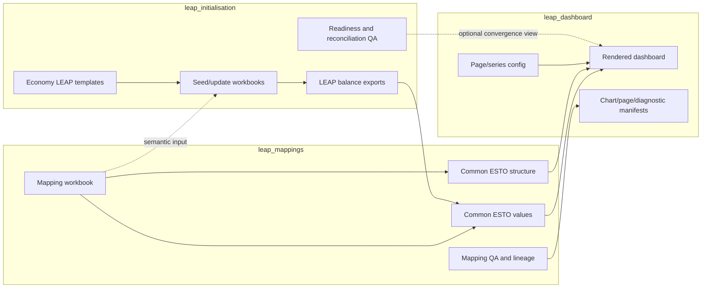

# Cross-repository data contracts

**Verified against current master code and artifacts:** 2026-07-28

**Contract owner:** `leap_mappings` for mapping outputs; each producer owns its
other rows below

This document describes the current producer/consumer boundary. It is not a
promise that every existing CSV is stable. Files marked **published** are the
supported boundary; files marked **diagnostic** are allowed to evolve with
their owning workflow.

## 1. Contract and ownership diagram



## 2. Producer/consumer matrix

| Producer | Output | Schema/key | Consumer | Purpose | Refresh trigger | Failure owner |
|---|---|---|---|---|---|---|
| mappings | `config/outlook_mappings_master.xlsx` | named sheets; pair keys per sheet | mappings; initialisation direct readers | canonical mapping semantics | reviewed mapping/rollup/name change | mappings |
| initialisation | `data/leap_export_templates/leap_export_template <economy>.xlsx` | LEAP export key and IDs | initialisation | preserve area structure and IDs | LEAP area structure change | initialisation |
| initialisation/LEAP | `data/leap balances exports/<economy>/...xlsx` | LEAP energy-balance export structure | mappings parser; initialisation results-update | observed model results | LEAP recalculate/export | initialisation/LEAP operator |
| mappings Stage 1 | `results/mapping_relationships/energy_balance_relationships.csv` | relationship/use-case rows | Stage 2 and QA | declared mapping graph | workbook or Stage 1 logic change | mappings |
| mappings Stage 2 | `results/common_esto/common_esto_rows.csv` | one common-row/component row | Stage 3; dashboard metadata | common structure and component membership | relationship/scope/override change | mappings |
| mappings convert | converted LEAP/9th/ESTO rows and compressed lineage | source/economy/scenario/year/pair | Stage 3 | source values in ESTO component space | source data or conversion change | mappings |
| mappings Stage 3 | `common_esto_comparison_data.csv` | long compound key below | dashboard | primary comparison values | structure or converted values change | mappings |
| mappings Stage 3 | `common_esto_comparison_wide.csv` | scope/economy/scenario/product/flow + years | dashboard compatibility loader | legacy-compatible input | Stage 3/fast path | mappings |
| mappings Stage 3 | `common_esto_output_status.csv` | run + artifact/validation rows | humans; dashboard provenance/diagnostics | identifies current output and validation state | every Stage 3/fast-path run | mappings |
| mappings Stage 3 | `stage3_run_manifest.json` | run ID, inputs, scopes, timings, validation | humans/agents | run provenance | full Stage 3 | mappings |
| mappings QA | exact rows, mapping QA, tree/anchor validation | diagnostic-specific | dashboard diagnostics | pipeline health views | owning mapping stage | mappings |
| initialisation | run-labelled seed/update workbooks | LEAP import layout/key | LEAP | set LEAP expressions | baseline/results-update/patch run | initialisation |
| initialisation | readiness findings/summary | rule/check rows; JSON summary | human import gate | prove import readiness | workbook generation | initialisation |
| initialisation | capacity convergence CSV | run/economy/scenario/product/pass | optional dashboard page | iterative reconciliation health | results-update pass | initialisation |
| dashboard | `outputs/common_esto_dashboard/<economy>/...` | HTML/JS plus manifests | reviewer/browser | presentation | input or dashboard config/code change | dashboard |

The dashboard also imports
`codebase.mapping_tools.source_branch_preflight` from the mappings repository
to resolve per-economy demand branches without detail. That Python API is a
live code dependency, not a file contract.

## 3. Canonical mapping workbook contract

| Sheet | Direction/role | Compound source key | Target key or special fields |
|---|---|---|---|
| `leap_combined_esto` | LEAP to ESTO | `leap_sector_name_full_path`, `raw_leap_fuel_name` | `esto_flow`, `esto_product` |
| `leap_combined_ninth` | LEAP to 9th | `leap_sector_name_full_path`, `raw_leap_fuel_name` | `ninth_sector`, `ninth_fuel` |
| `ninth_pairs_to_esto_pairs` | 9th to ESTO | `ninth_sector`, `ninth_fuel` | `esto_flow`, `esto_product` |
| three `*_rollup_rules` sheets | hierarchy reconciliation | input pair/branch | rolled pair/branch, include, mode/context and notes |
| `rollup_label_overrides` | generated-label control | scope/partition identity | reviewed display label |
| `leap_display_names` | code display overrides | `code_type`, `code` | LEAP display name and match flag |

`duplicate_to_remove` is historical terminology in the current schema. Active
loaders interpret the row status; maintained sheets should contain only
believed-correct active relationships. Never restore a formerly absent row
solely because it is missing.

After any sheet or column rename, coordinate all direct readers in both
`leap_mappings` and `leap_initialisation`. A future directional sheet rename is
already queued and must not be made in one repository alone.

## 4. Published Common ESTO contracts

### 4.1 Versioned v1 contract

`common_esto_output_contract_v1` is the atomic, hash-verified producer/consumer
boundary:

| Member | File | Ordered columns/key |
|---|---|---|
| manifest/commit marker | `common_esto_output_contract.json` | contract version, run ID, timezone-aware run timestamp, observed-rows flag, and fact/metadata member path, ordered schema, key, row count, byte size, SHA-256 |
| narrow fact | `common_esto_comparison_fact.csv.gz` | `comparison_scope, source_system, economy, scenario, year, common_row_id, value`; all except `value` form the key |
| compound-keyed metadata | `common_esto_row_metadata.csv` | `comparison_scope, common_row_id`, flow/product code/name/label fields, row basis, exact/rollup booleans, non-expanding ID, rollup mode, aggregate labels/group IDs; the first two columns form the key |

Mappings stages all three members and promotes the manifest last. It restores
the previous generation if promotion or final hash verification fails. A
QA-successful Stage 3 run publishes the canonical generation; a review-tagged
or failed run preserves the preceding contract and records the divergence in
provenance. Dashboard selection is explicit:
`COMMON_ESTO_USE_OUTPUT_CONTRACT=1`, with optional
`COMMON_ESTO_OUTPUT_CONTRACT_PATH`. A selected invalid contract fails without
falling back to legacy data.

The implementation and focused verification are integrated on both local
`master` branches, but the current files under `results/common_esto/` predate
that integration and do not yet contain a production v1 generation.

### 4.2 Long comparison values

Current columns:

```text
comparison_scope, source_system, economy, scenario, year,
common_flow_code, common_flow_name, common_flow_label,
common_product_code, common_product_name, common_product_label,
common_row_id, common_row_basis,
is_exact_row, requires_rollup, is_non_expanding_rollup,
non_expanding_rollup_id, rollup_mode,
source_aggregate_labels, source_aggregate_group_ids, value
```

Compound key:

```text
(comparison_scope, source_system, economy, scenario, year, common_row_id)
```

`source_system` must not be dropped. `comparison_scope` must not be flattened
across scopes. Missing source-year observations are absent in long form, not
implicit zeros.

### 4.3 Common-row structure

Current principal columns:

```text
comparison_scope, common_structure_version, common_row_id,
common_flow_code, common_flow_name, common_flow_label,
common_product_code, common_product_name, common_product_label,
component_esto_flow, component_esto_product,
component_flow_code, component_flow_name,
component_product_code, component_product_name,
component_sign, is_exact_row, requires_rollup,
is_non_expanding_rollup, non_expanding_rollup_id, rollup_mode,
common_row_basis, source_aggregate_labels, source_aggregate_group_ids
```

Grain: one `(comparison_scope, common_row_id, component pair)` record.
`common_structure_version` is the compatibility handle.
`component_sign` is application semantics, not dashboard presentation.

### 4.4 Exact ESTO and ESTO Extended rows

Both compressed files currently use:

```text
economy, esto_flow, esto_product, year, value,
source_system, scenario, non_expanding_rollup_id
```

The canonical paths end in `.csv.gz`. Consumers use compression-aware path
resolution and must not assume a plain `.csv`.

### 4.5 Wide compatibility output

```text
comparison_scope, economy, scenario, product, flow, is_subtotal,
1980 ... 2070
```

`scenario` combines source system and scenario. A consumer must select exactly
one `comparison_scope` before melting to long form.

### 4.6 Status and provenance

`common_esto_output_status.csv` contains artifact rows and validation rows.
Important fields include:

```text
run_id, run_timestamp_utc, record_type, artifact_name,
validation_name, validation_axis, source_system, status,
checks_performed, eligible_parent_count, mismatch_count, reason,
current_output_file, output_path, output_mtime_ns,
input_path, input_mtime_ns, input_mtime_utc, input_size_bytes,
comparison_scope, eligible, passed, failed, skipped
```

Rules:

1. Read the artifact row for `common_esto_comparison_data`.
2. Resolve `current_output_file`; do not guess that the canonical filename was
   overwritten.
3. Confirm the run ID and input/output timestamps.
4. Inspect every relevant validation status and reason.
5. Treat `skipped` as not validated.
6. Treat `failed` findings as unresolved evidence even when
   `stage3_run_manifest.json` says `completed`.

The run manifest records paths/sizes, scopes, timings, and validation summaries.
Current master does not record a complete content hash of the workbook and all
inputs. Record the Git commit and workbook state separately in run notes.

## 5. LEAP template and import-workbook contract

LEAP workbooks use:

- metadata row 0;
- blank row 1;
- headers on row 2 (`pandas header=2`);
- ID columns: `BranchID`, `VariableID`, `ScenarioID`, `RegionID`;
- key: `Branch Path`, `Variable`, `Scenario`, `Region`;
- metadata: `Scale`, `Units`, `Per...`;
- value: `Expression`;
- synchronized Level columns.

The key must be unique. IDs and metadata come from the target economy’s
template. A `-1` ID is unresolved, not a usable identity. Import-readiness
findings are the release gate; existence of an `.xlsx` file is not sufficient.

Run-labelled output roots prevent cross-run mixing:

```text
outputs/leap_exports/supply_reconciliation/
  baseline_seed/runs/<run_label>/
  results_update/runs/<run_label>/
```

Each run can contain per-economy workbooks, a consolidated workbook, balance
tables, checks, runtime/timing state, baseline validation, export-readiness
summaries, and module-specific supporting evidence.

## 6. Dashboard consumer contract

The default input paths are resolved from sibling `leap_mappings`, with
environment overrides:

| Setting | Default |
|---|---|
| `LEAP_MAPPINGS_ROOT` | sibling `../leap_mappings` |
| `COMMON_ESTO_INPUT_DATA_PATH` | `results/common_esto/common_esto_comparison_data.csv` |
| `COMMON_ESTO_ROWS_PATH` | `results/common_esto/common_esto_rows.csv` |
| comparison scope | `esto_leap_ninth` |
| output root | `outputs/common_esto_dashboard` |

The loader accepts long or wide CSV based on columns, not filename. It does not
accept arbitrary ESTO/9th/LEAP source tables.

Per-economy output layout:

```text
outputs/common_esto_dashboard/<compact_economy>/
  dashboards/*.html
  chart_bundles/*.js
  chart_bundles/*.json
  supporting_files/chart_manifest.csv
  supporting_files/page_assignment_summary.csv
  supporting_files/sign_semantics_summary.csv
  supporting_files/mapping_diagnostics_summary.csv
  supporting_files/dashboard_metadata.json
```

Publishing copies only HTML and JS to `docs/<economy>/`; supporting evidence
stays under `outputs/`.

The authoritative economy list is
`leap_dashboard/config/common_esto_dashboard/series_config.json`. Dashboard
keys are compact (`20USA`, `02BD`); source/workflow codes commonly contain an
underscore (`20_USA`, `02_BD`). `02_BD` is Brunei Darussalam.

## 7. Configuration ownership

| Configuration | Owner | Consumers | Change impact |
|---|---|---|---|
| canonical mapping workbook | mappings | mapping stages; initialisation loaders | coordinated schema and full affected rerun |
| mapping exception workbook | mappings | maintenance and mapping QA | rerun affected QA/stages |
| source coverage and aggregate-component config | mappings | Stage 2/3; dashboard live import | mapping and dashboard verification |
| LEAP templates | initialisation | initialisation | regenerate/validate affected economy workbooks; mapping parse if export structure changed |
| reconciliation config/caps | initialisation | initialisation | rerun affected economy/pass |
| dashboard template | dashboard | renderer | rerender and readiness/page-noise checks |
| dashboard series/economy config | dashboard | all three by reference | rerender; coordinate code normalization if keys change |

## 8. Refresh and reuse rules

| Artifact | Safe to reuse when | Stale when |
|---|---|---|
| Stage 1 relationships | workbook mappings/rollups and Stage 1 code unchanged | any mapping/rollup/use-case change |
| Stage 2 Common rows | relationships, scopes, overrides, names, Stage 2 code unchanged | structural or comparison-scope change |
| converted source values | source files and conversion logic unchanged | source vintage/export/conversion change |
| Stage 3 values | Common rows and converted values unchanged | either input changed |
| mapping fast-path result | all cached inputs above are current | Stage 0–2 or conversion should have rerun |
| initialisation seed | source/config/template and run scope unchanged | any producer/config/template change |
| dashboard render | input values/structure and dashboard code/config unchanged | either producer or presentation changed |

The mapping pipeline and dashboard fast path must not write the same output
directory concurrently. Initialisation’s per-economy locks prevent overlapping
economy writes but do not protect concurrent LEAP COM/API operations.

## 9. Cross-repository schema-change protocol

1. Name the producer, consumers, old schema, new schema, and compatibility
   period.
2. Update producer and consumer loaders in coordinated branches.
3. Add schema/key tests on both sides.
4. Regenerate a representative mapping output and dashboard fixture.
5. Compare row counts, keys, totals, lineage, and rendered chart/page manifests.
6. Update this contract and repository-owned agent guides.
7. Merge producer and consumer halves together.

This protocol was used for `common_esto_output_contract_v1`. The producer half
is now on `leap_mappings` `master` (`1f48790`, `4f41ecc`) and the strict opt-in
consumer plus provenance handling is on `leap_dashboard` `master` (`3b4608c`,
`e12029b`, `8bac7d5`, `71826b1`). Do not treat the old
`codex/output-contract-phase-2` worktrees as the authoritative implementation.
The remaining operational step is to publish the first QA-successful contract
generation and select it explicitly in a downstream render.

## 10. Known contract gaps

| Gap | Current status | Queue owner |
|---|---|---|
| first production artifact generation under `common_esto_output_contract_v1` | producer/consumer code and focused verification are integrated, but current result files predate the contract | mappings, then dashboard |
| LEAP balance exports as a declared sibling contract | mappings resolves sibling exports, but older local copies and docs remain | mappings + initialisation |
| dashboard imports mapping Python directly | supported but tightly coupled | mappings + dashboard |
| external structural notes under `C:\Users\Work\.codex` | not available in a clean clone | handover queues |
| local masters ahead of remotes | work exists only on this machine until normal push process | each repository |
| Stage 0 live code under `codebase/archive/` | operationally valid but surprising navigation | mappings |
