# End-to-end LEAP system guide

**Evidence snapshot:** 2026-07-29

**Audience:** analysts, maintainers, and technical project staff
**Detail level:** Level 2

This guide explains the connected mapping, LEAP-initialisation, and dashboard
system. It concentrates on why the boundaries exist and how information moves.
Exact run settings and safety procedures are in the
[agent operations guide](agent_operations_guide.md).

## 1. Evidence inventory and current state

The documentation was checked against current code, configuration, artifacts,
worktrees, recent commits, and queues in all three repositories.

| Area | Entry points and evidence inspected | Current evidence state |
|---|---|---|
| Mapping | `run_mapping_pipeline.py`; optional hierarchy/ESTO-row workflows; Stage 1–3 modules; canonical workbook; Common ESTO outputs; pipeline log and manifest | The core pipeline starts at Stage 1; hierarchy and source-row maintenance are explicit review workflows |
| Initialisation | reconciliation workflow/config/allocation modules; seed patcher; templates; latest real three-economy run; readiness summaries | Latest three-economy baseline run took 1h 26m 50.9s; it wrote workbooks but USA readiness still reports 3,244 blocking findings |
| Dashboard | workflow/data/renderer/layout modules; template and series config; 21 economy output folders; logs and manifests | Long and legacy wide input are supported; default run uses long input; latest two-economy log wrote 650 charts |
| Contracts | current output headers; manifests; producer and consumer contract code; consumer path constants | `common_esto_output_contract_v1` is integrated on both current masters, including hashes and strict opt-in loading; the artifacts on disk predate that integration and must be republished by a QA-successful Stage 3 run |
| Repository state | status, branches, worktrees, recent commits, controlling queues | Mappings and dashboard have unrelated dirty files; all three local masters are ahead of their remotes; documentation changes must be staged narrowly |

Important corrections to older prose:

- The former Stage 0 monolith is retired under `codebase/archive/`. Structural
  subtotal review and missing mapped ESTO-row preparation now use separate,
  review-only workflows.
- The dashboard is production code under `codebase/`, not a prototype under
  `test/`.
- A completed run is not a clean run. Current Stage 3 artifacts contain failed
  hierarchy/anchor validation groups, and current baseline-seed artifacts can
  contain blocking import-readiness findings.

## 2. Ownership model

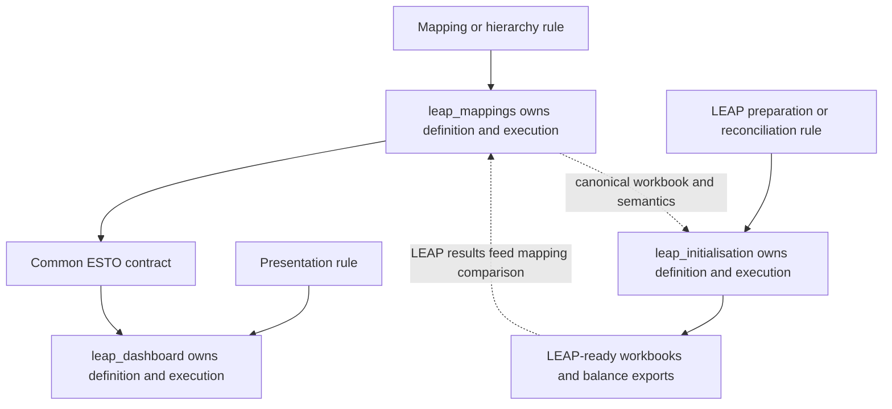

| Question | Rule defined in | Rule executed in | Output consumed by | Diagnose first | Fix owner |
|---|---|---|---|---|---|
| What does a LEAP/9th row mean in ESTO terms? | `leap_mappings` workbook | mapping Stages 1–3 | initialisation and dashboard | mapping row, relationship, lineage | `leap_mappings` |
| How is a supply gap allocated? | initialisation config/logic | reconciliation | LEAP import | reconciliation/ledger diagnostics | `leap_initialisation` |
| Which page shows a common row? | dashboard template | renderer | browser | page assignment summary | `leap_dashboard` |
| Why is a common row absent? | mapping scope/membership | Stage 2/3 | dashboard | structural coverage and missing-map QA | `leap_mappings` |
| Why will a workbook not import? | template and emit/readiness rules | initialisation | LEAP | ID, branch, duplicate-key findings | `leap_initialisation` |

## 3. Mapping pipeline

### 3.1 Pipeline stages as implemented

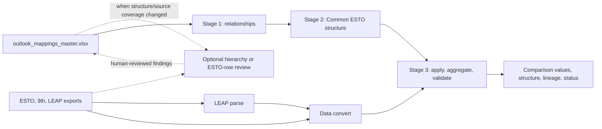

| Stage | Current implementation | Principal inputs | Principal outputs | Main question |
|---|---|---|---|---|
| 1 | `build_energy_balance_relationships.py` | active mapping sheets and rollup rules | relationship table/catalogue and conversion QA | What source-to-target relationships are declared for each use case? |
| 2 | `build_common_esto_structure.py` | relationships, exclusions, overrides, names, rollup metadata | Common ESTO rows/components/maps and structural QA | What non-overlapping common rows make all included sources comparable? |
| Parse | `parse_leap_balance_export.py` through orchestrator | sibling LEAP balance exports | raw long LEAP rows | What values did LEAP report? |
| Convert | conversion modules and exact-row selection | LEAP, 9th, ESTO, ESTO Extended | ESTO-shaped source values plus lineage | How does each source value enter the ESTO component space? |
| 3 | `apply_common_esto_structure.py` plus validation orchestration | converted source values and Common ESTO rows | long/wide comparison data, lineage, status, validation | Were values applied, conserved, covered, and published with evidence? |

The canonical mapping workbook’s important sheets are:

- `leap_combined_esto`;
- `leap_combined_ninth`;
- `ninth_pairs_to_esto_pairs`;
- `leap_rollup_rules`, `esto_rollup_rules`, `ninth_rollup_rules`;
- `rollup_label_overrides`;
- `leap_display_names`;
- catalog/reference sheets for unique ESTO and 9th codes.

Researchers maintain believed-correct relationships. Rejected rows are removed;
their history belongs in QA, decisions, or Git—not as automatic guardrail rows
in maintained sheets.

### 3.2 How Stage 1 and Stage 2 solve different problems

Stage 1 preserves declared directional mappings and their use cases. It applies
configured rollup rules and produces relationship-level risk/coverage evidence.
The same `relationship_id` can appear once per use case.

Stage 2 does graph partitioning over the ESTO component space. It does not
guess by label. Connected components, overrides, comparison scopes, and
non-expanding metadata determine common rows. An exact one-component row keeps
the exact ESTO code. A generated row carries explicit component membership.

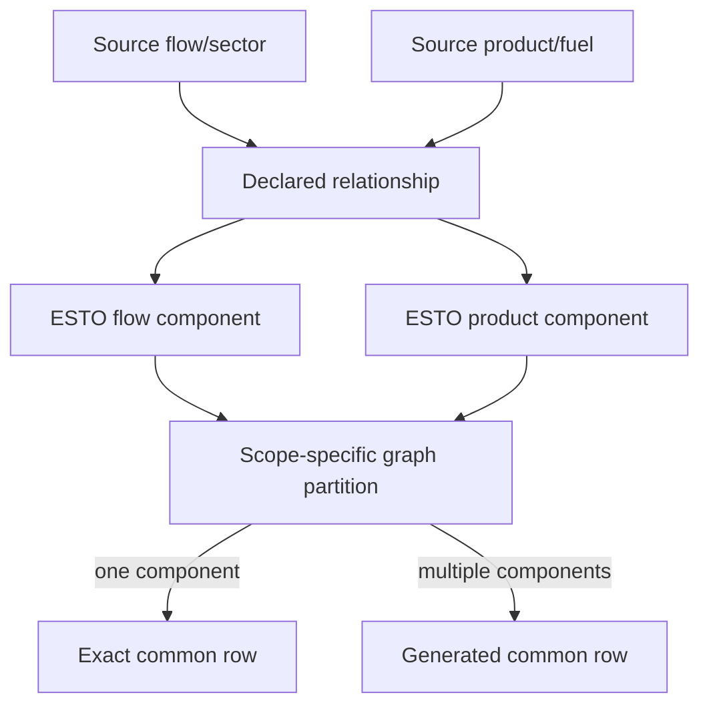

### 3.3 Hierarchy, subtotals, and additive frontiers

ESTO codes use dot-separated hierarchy, while 9th uses sector/fuel columns and
LEAP uses branch paths. A parent label does not prove that a row is safely
additive. The pipeline builds explicit tree/edge evidence and distinguishes
ordinary additive parents from non-expanding or detached rollups.

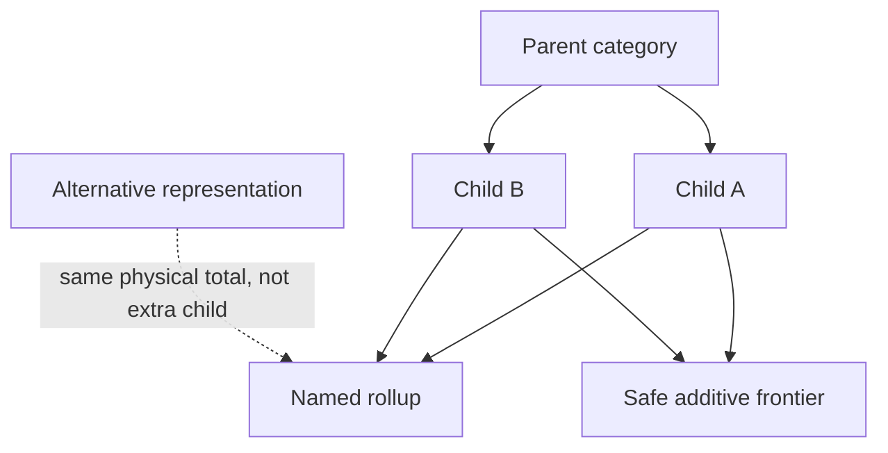

The additive frontier is the non-overlapping set to sum. If both parent and
children are present, summing all three double counts. Non-expanding and
detached rollups need explicit treatment because they may be alternative
representations, not additional additive children. This ownership is still a
cross-repository human decision for some dashboard aggregates; the dashboard
must use mapping membership and metadata rather than inventing a frontier.

### 3.4 Stage 3 in detail

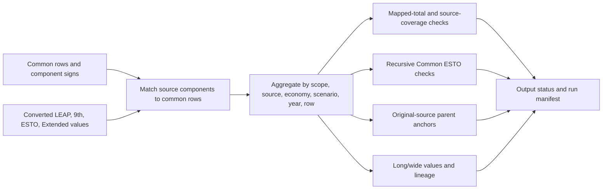

Stage 3:

1. reads converted source rows;
2. filters relevance and explicit unmodelled scope;
3. applies component signs and common-row membership;
4. aggregates by the compound output key;
5. writes values and component/source lineage;
6. runs mapped-total, source-coverage, recursive hierarchy, and original-source
   anchor checks;
7. writes `common_esto_output_status.csv` and `stage3_run_manifest.json`.

The long output does not zero-fill missing source years. The legacy-compatible
wide output pivots years and folds `source_system` into `scenario` because it
has no separate source-system axis.

If mapping-application QA marks an error, Stage 3 writes
`*_needs_mapping_review.csv` rather than replacing canonical values. If a CSV
is locked, it writes a `_rebuilt` variant. The status file’s
`current_output_file` is therefore authoritative.

Recursive or anchor findings can be `failed` while the run manifest says
`completed`. These are review evidence, not proof that the file is releasable.
Likewise, a `skipped` validation means “not validated,” never “passed.”

### 3.5 Fast path and candidates

`regen_common_esto_comparison_fast_path_workflow.py` and the dashboard’s
opt-in `UPDATE_DATA` route reuse cached converted values and Common ESTO rows.
They skip Stage 1, Stage 2, tree validation, anchor validation, and
candidate diagnostics. Use them only when those cached inputs remain valid.

Candidate generation infers the flow/sector axis and product/fuel axis
independently. Only observed, non-zero, complete, high-confidence candidates
belong in copy-ready candidate files. No candidate is written into the
canonical workbook automatically.

ESTO Extended supplies a second ESTO-shaped reference. Creating a stable
category is a structural decision; allocating values into it is a separate
evidence decision. See
`docs/esto_extended_category_creation_considerations.md`.

## 4. Supply reconciliation and LEAP initialisation

### 4.1 What the workflow consumes and owns

Initialisation reads canonical mappings and equivalent ESTO/9th source
datasets, but it owns:

- supply target preparation;
- transformation, transfer, loss, own-use, and demand modules;
- gap allocation and capacity/production caps;
- per-economy templates and LEAP IDs;
- seed assembly and import-readiness checks;
- the manual LEAP iteration loop.

It does not consume the dashboard HTML or redefine a mapping pair.

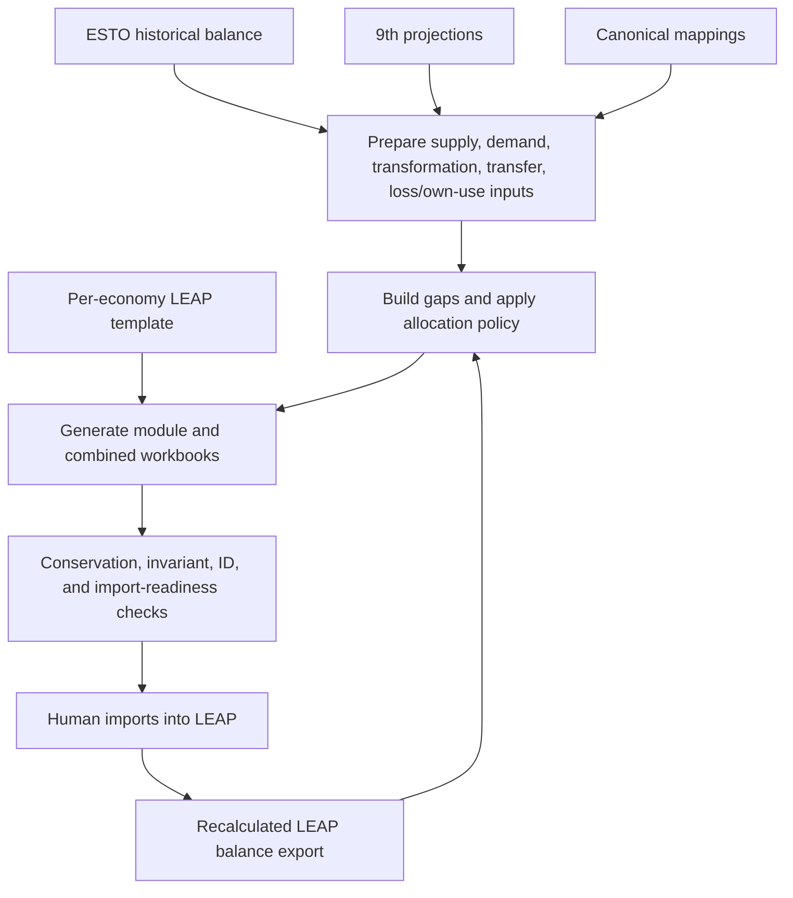

### 4.2 Preparation, reconciliation, allocation, and export are distinct

| Layer | Purpose | Examples |
|---|---|---|
| Preparation | make comparable supply/transformation/demand inputs | source loading, subtotal removal, scenario/economy normalization |
| Reconciliation | calculate expected-versus-observed gaps | yearly balance and reconciliation tables |
| Allocation | choose how a gap changes LEAP controls | production headroom, transformation capacity, export pinning, import fallback |
| Export generation | merge values into LEAP-shaped rows | `Maximum Production`, `Exogenous Capacity`, Imports, Exports |
| Validation | prove structural and numeric readiness | IDs, duplicate keys, shares, fuel catalog, conservation |
| LEAP interaction | import, recalculate, export | manual by default; COM helpers are Windows-only and not the primary loop |

### 4.3 Treatment of major balance components

| Component | Current treatment |
|---|---|
| Production | primary-resource `Maximum Production`; production headroom is normally attempted before fallback imports |
| Imports | final balancing signal/fallback for tradeable fuels; avoid hard-coding early because it can hide upstream problems |
| Exports | preserved/projected; negative-gap behavior is controlled and can be pinned to 9th projections |
| Stock changes and statistical differences | source/export rows exist, but template support can be economy-dependent; unresolved IDs remain a known template gate |
| Bunkers | negative supply-side use, treated consistently with exports in balance calculations |
| Transfers | dedicated upstream-liquids, refining/blending, and unallocated processes |
| Transformation inputs | negative feedstock; capacity and efficiency determine output |
| Transformation outputs | positive output; conservation compares generated outputs with source targets |
| Loss and own use | proxy workflow uses ESTO/9th activity in baseline-seed mode and LEAP-balance activity in results-update mode |
| Aggregated demand | temporary/aggregate branch treatment where detailed LEAP demand sectors are unavailable |

Natural gas is currently production-only in the capacity-unmet allocator: it
does not let downstream transformation capacity conceal a primary-production
shortfall.

### 4.4 Baseline seed and import generation

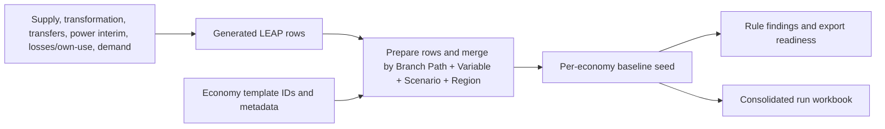

The four-part key must be unique. Branch/variable/scenario/region IDs and
metadata come from the correct economy template and must not be fabricated.
`-1` is an unresolved sentinel. Level columns must remain synchronized with
the branch path, and the LEAP preamble/header structure must be preserved.

Aggregate economy `00_APEC` can use special aggregate/no-template behavior.
Real economies should resolve their own templates; do not copy USA IDs into
another economy.

The patch mode replaces a reviewed module slice in an existing seed and passes
through the same emit-boundary validation. Only modules whose patch path is
documented as verified should be treated as safely patchable.

### 4.5 The iterative loop

The default operational loop is:

1. generate a baseline seed or results-update workbook;
2. pass readiness checks;
3. import into the intended LEAP area;
4. recalculate;
5. export an Energy Balance at sufficient detail;
6. run results-update reconciliation;
7. inspect gaps, caps, conservation, and readiness evidence;
8. repeat until remaining differences are small and explained.

LEAP energy-balance export can take hours. It is not the same as the Python
workflow runtime.

## 5. Dashboard pipeline

### 5.1 Ingestion and transformations

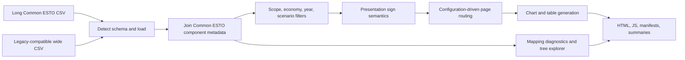

The loader recognizes:

- long Common ESTO data when all required long columns are present;
- wide Common ESTO data when identity columns and year columns are present.

Wide input must select one comparison scope to avoid duplicating scenarios.
Long input carries its own `comparison_scope`. The production default is the
long `common_esto_comparison_data.csv`.

Dashboard preprocessing normalizes economy codes to compact form for folders
(`20_USA` to `20USA`), excludes 9th rows before the base year by default,
filters scope/economy/year, applies visible-series rules, joins component
metadata, and applies sign rules for presentation.

### 5.2 Presentation is not mapping

The dashboard may:

- hide a page when LEAP lacks detailed branches for an economy;
- route rows to Supply, Power, Refining, Transport, and other pages;
- choose line, stacked-area, or summary charts;
- suppress small line charts while retaining a manifest record;
- calculate historical LEAP–ESTO and projection LEAP–9th differences;
- apply stable colours and human-facing sign notes.

It may not change source-to-target membership, infer hierarchy from labels, or
create a dashboard-only mapping. Component membership remains upstream truth.

The line-chart frontier helper avoids parent/child overlap. Total-demand and
other aggregates use configuration plus Common ESTO metadata; they must not sum
an arbitrary mixture of parents and children.

### 5.3 Outputs, regeneration, and publication

Each economy output contains:

- `dashboards/*.html`;
- `chart_bundles/*.js` and local JSON bundles;
- `supporting_files/chart_manifest.csv`;
- page assignment, sign semantics, metadata, and mapping-diagnostic summaries.

`CLEAR_EXISTING_OUTPUTS=True` removes the generated dashboard/chart/supporting
folders for that economy before rebuilding. Ordinary rendering does not refresh
upstream data. `UPDATE_DATA=True` is an opt-in fast-path mutation of
`leap_mappings/results/common_esto`; it is not a complete mapping rerun.

`PUBLISH_TO_DOCS` is off by default. Publishing copies HTML and JS only;
supporting CSV/XLSX files remain under `outputs/`. Readiness and page-noise
checks remain required. Commit `b125425` suppresses empty area figures and the
dashboard's recorded legacy/contract equivalence run passed publication
readiness for `20USA` and `02BD`; repeat the checks for any newly rendered
generation before publishing.

## 6. Cross-repository sequence and staleness

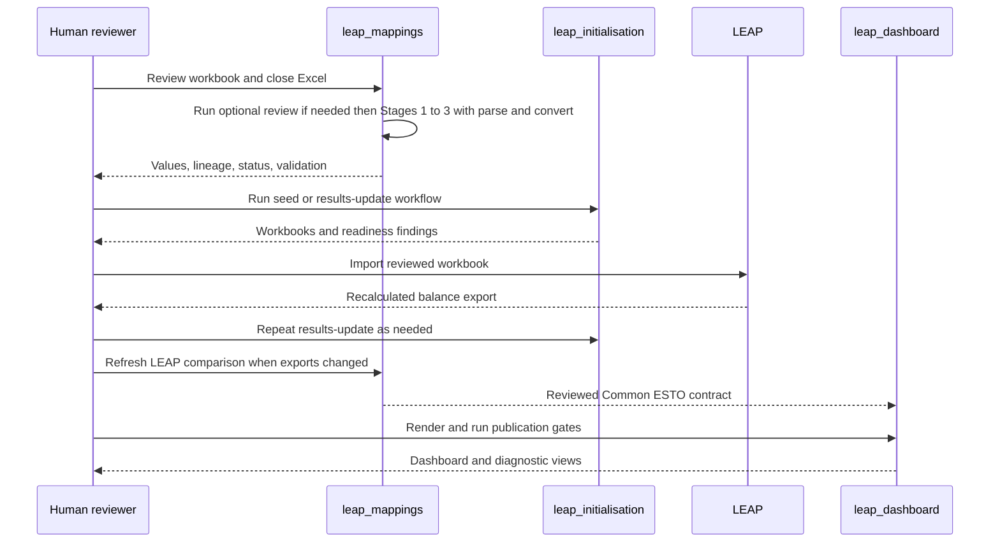

| Change | Optional hierarchy/source review | Stage 1 | Stage 2 | Convert | Stage 3 | Initialisation | Dashboard |
|---|---:|---:|---:|---:|---:|---:|---:|
| canonical mapping row | if structural/category coverage changed | yes | yes | usually yes | yes | affected preparation | yes |
| rollup/scope/override | hierarchy review if structural meaning changed | yes | yes | if conversion rule changed | yes | if consumed rule changed | yes |
| ESTO/9th source vintage | ESTO-row review if categories changed | if coverage/cardinality changes | yes | yes | yes | yes | yes |
| LEAP balance export only | no | no | no | LEAP only | yes | results update | yes |
| LEAP template structure | hierarchy contract review | maybe | maybe | LEAP parse/convert | yes | yes | yes |
| dashboard routing/config only | no | no | no | no | no | no | yes |
| cached source values only, structure unchanged | no | no | no | if stale | fast path allowed | independent | yes |

Never reuse an output merely because its filename exists. Compare the status
file, run ID, timestamps, input fingerprints where available, Git commit, and
workbook state. The Stage 3 manifest records run ID, timestamp, input
paths/sizes, timings, scopes, and validation summaries but not a complete
workbook hash. The integrated `common_esto_output_contract_v1` separately
records ordered schemas, keys, row counts, byte sizes, and SHA-256 hashes for
its fact and metadata members. It is published only for a QA-successful run;
the current `results/common_esto/` directory has not yet been regenerated with
those three contract files.

## 7. Validation severity

| Evidence | Typical severity | Does generation continue? | Interpretation |
|---|---|---:|---|
| missing required input/schema | blocking | no | fix producer or contract |
| Stage 3 mapping-application error | blocking for canonical publication | writes review-tagged output | canonical file should not be treated as refreshed |
| locked CSV/workbook fallback | operational blocker for canonical refresh | writes `_rebuilt`/preview | close file and rerun |
| duplicate key or unresolved non-zero LEAP ID | blocking import readiness | workbook may exist | do not import |
| fuel-catalog or template-coverage error | blocking import readiness | workbook may exist | fix source/template |
| conservation warning under non-strict policy | review | yes | green process completion does not prove conservation |
| recursive or source-anchor mismatch | review/failure evidence | yes | investigate hierarchy, exclusions, rollup, or source values |
| `skipped` validation | unknown/not validated | yes | never present as pass |
| mapping candidate | review only | yes | human decides whether to edit workbook |
| empty diagnostic file | clean only if file exists and the check ran | yes | absence of file is unknown, not clean |

## 8. Human decision register

| Decision | Why a person is required | Where to record it |
|---|---|---|
| accept/reject a mapping candidate | semantic correctness and sibling/cardinality effects | workbook plus mapping decisions/queue |
| create an ESTO Extended category | stability, authority, completeness | ESTO Extended design/decision docs |
| allocate values to an Extended category | evidence may be incomplete or ambiguous | source-backed decision record |
| approve a subtotal/leaf or many-to-many exception | hierarchy differences may be intentional | exception workbook and decision docs |
| choose reconciliation caps/import/surplus policy | physical and modelling judgement | initialisation config and decisions |
| accept unresolved template exceptions | may make a workbook non-importable | initialisation queue/readiness evidence |
| choose additive frontier for a presentation aggregate | risk of double counting | coordinated mapping/dashboard decision |
| publish dashboards with known gaps | audience and release risk | dashboard queue/release record |

## 9. Diagnostic routing

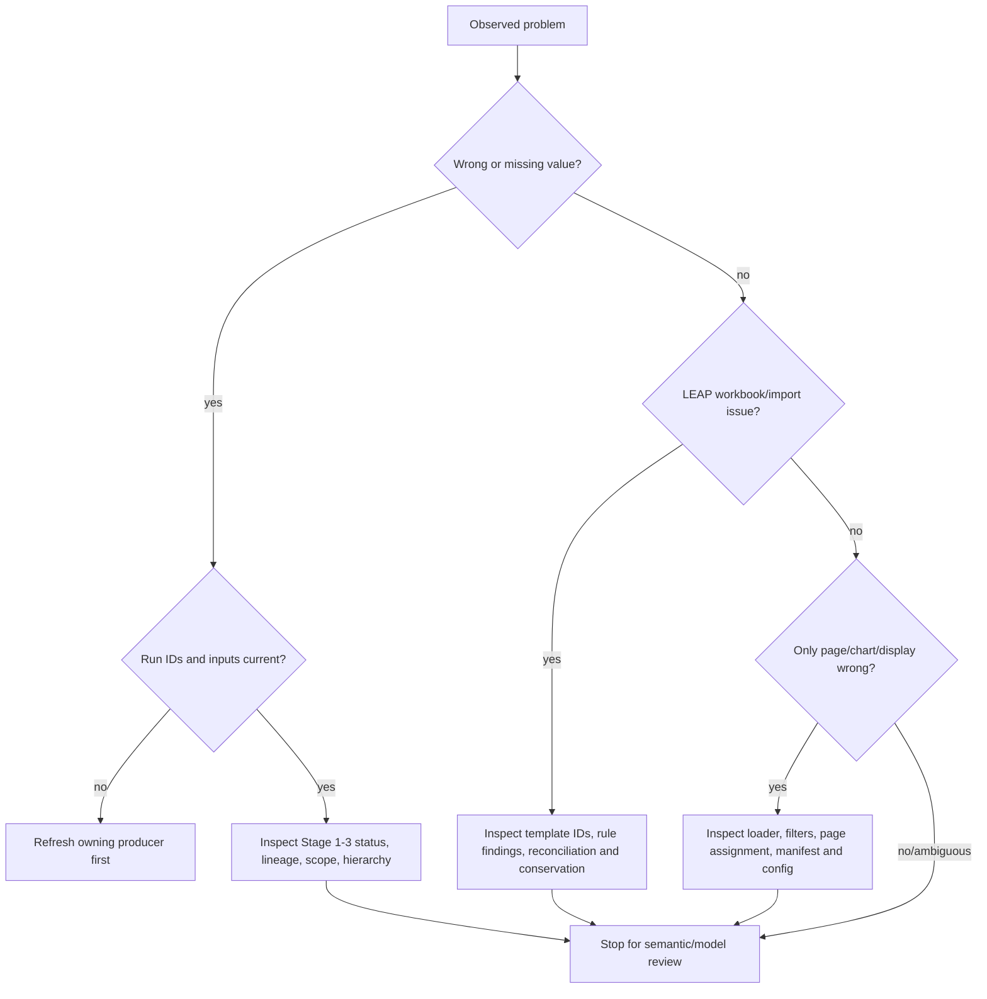

| Symptom | Likely layer | First evidence | Owner | Unsafe shortcut |
|---|---|---|---|---|
| Common row missing | mapping structure/scope | structural partial coverage and map files | mappings | add a dashboard-only row |
| Wrong value on correct common row | conversion/application | component/source lineage and total checks | mappings | edit generated CSV |
| Dashboard input stale | refresh/provenance | output status and dashboard input path | mappings first | rerender repeatedly |
| Chart on wrong page | presentation routing | page assignment summary | dashboard | rename upstream mapping label |
| Wrong LEAP production/import | reconciliation/allocation | balance table, gap and cap diagnostics | initialisation | hard-code imports immediately |
| Unknown LEAP branch/ID | template/export boundary | export-readiness findings | initialisation | fabricate/copy IDs |
| Empty transfers chart | data or suppression boundary | manifest and underlying scoped rows | dashboard then mappings | publish because HTML exists |
| Validation shows zero failures but was skipped | diagnostic reporting | status/reason columns | owning validator/UI | call it a pass |

## 10. Change impact

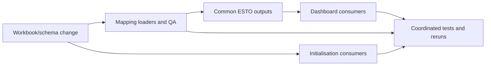

| Change | Required coordination |
|---|---|
| mapping workbook sheet/column rename | every direct loader in mappings and initialisation; tests; docs; generated `source_sheet` labels |
| Common ESTO column/key change | mapping producer and dashboard loader in one coordinated change |
| comparison-scope membership change | Stage 2/3, dashboard filters/pages, fixture refresh |
| module or function imported live by dashboard | preserve API or update dashboard in same release |
| LEAP branch/template change | initialisation template, mapping LEAP parsing/hierarchy, balance exports |
| economy code list change | dashboard `series_config.json`, then all consumers |
| sign convention change | source conversion and conservation first; dashboard sign presentation second |

## 11. Worked lineage: production of natural gas

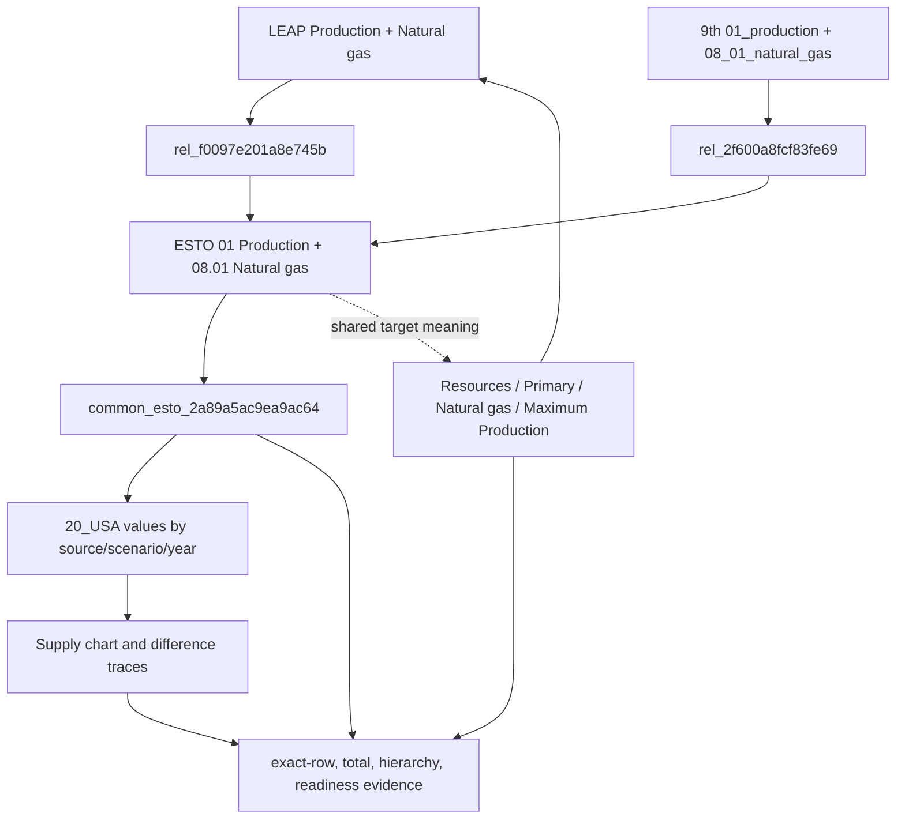

The exact identifiers and representative values are listed in the
[start-here worked example](README.md#a-real-row-usa-natural-gas-production).
The example demonstrates all three ownership boundaries:

- mappings decides that the source categories meet at the exact ESTO pair;
- initialisation uses the supply meaning to populate an ID-preserving LEAP
  resource variable;
- dashboard renders the published common row and computes differences without
  altering its membership.

## 12. Canonical detailed references

This guide deliberately links rather than copying complete rule inventories:

- mappings: `docs/mappings_system.md`,
  `docs/special_rules_and_design_decisions.md`,
  `docs/rollup_rules_system.md`;
- initialisation: `docs/supply_reconciliation_workflow_guide.md`,
  `docs/check_registry.md`, `docs/baseline_seed_rule_inventory.md`,
  `docs/special_rules_and_design_decisions.md`;
- dashboard: `docs/special_rules_and_design_decisions.md`,
  `config/common_esto_dashboard/`, and its controlling `docs/work_queue.md`.
