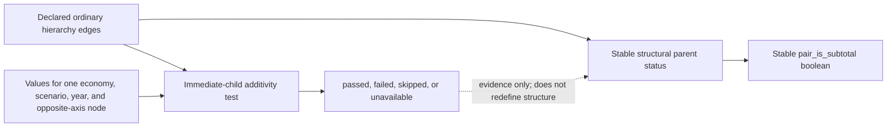

# Hierarchy/subtotal contract

**Contract:** `aperc_hierarchy_subtotal_contract`

**Schema version:** `hierarchy_subtotal_contract_v1`

**Status:** maintained semantic reference with dated verification evidence

**Owner:** `leap_mappings`

## Decision

A node is a structural parent when the authoritative hierarchy declares at
least one ordinary child. A mapping-side pair is a subtotal when either mapping
axis is a structural parent:

```text
pair_is_subtotal = any(axis_node_is_structural_parent)
```

Numerical additivity is contextual evidence. It never changes that structural
boolean.



The structural contract is separate from
`common_esto_output_contract_v1`. Component-grain nodes, edges, and diagnostics
do not fit that contract's one-row-per-observed-comparison-row metadata grain.
The Common ESTO manifest references the selected structural build instead.

## Packaging and publication

The default build directory is:

```text
results/hierarchy_subtotal_contract/current/
```

The manifest is the commit marker. A consumer must select one directory
explicitly, validate the contract name, schema version, and build identity,
verify every member hash and row count, and fail closed. It must not silently
fall back to another build or recompute structural truth from local source
tables.

The manifest records:

- input paths, hashes, and sizes;
- adapter and producer versions;
- producer commit and generation time;
- member hashes, row counts, and key columns;
- compatibility declarations and validation status;
- a content-derived build ID.

## Contract members

| Member | Grain | Purpose |
|---|---|---|
| `datasets.csv` | dataset | Source version, adapter version, raw/derived kind, and provenance |
| `axis_nodes.csv` | dataset + axis + node | Declared parent, depth, child count, leaf/parent status, hierarchy completeness, and source flags retained as evidence |
| `declared_relationship_edges.csv` | dataset + axis + parent + child + relationship type | Ordinary hierarchy separated from additive rollups, aliases, replacements, detached boundaries, and graph categories |
| `canonical_source_pairs.csv` | dataset + two normalized mapping-axis nodes | Per-axis structural booleans and canonical pair subtotal boolean |
| `value_conformance_diagnostics.csv` | dataset + context + validation axis + parent + fixed opposite-axis node | Parent value versus immediate-child sum without changing structural status |

## Invariants

- Ordinary hierarchy edges alone automatically define structural parenthood.
- Duplicate nodes, duplicate edges, self-parent edges, missing ordinary-edge
  endpoints, contradictory ordinary parents, and cycles are rejected.
- `pair_is_subtotal` is exactly
  `any(axis_node_is_structural_parent)`.
- Complete active mapping pairs contain a boolean only when both nodes resolve.
  Unresolved evidence remains in the review queue.
- `MIXED` is never a canonical boolean.
- An additivity failure remains a failure even when it is attributable to
  source non-additivity.
- `passed` is not used for missing or untested contexts.

## Relationship types stay separate

Ordinary source hierarchy is not interchangeable with comparison
relationships. The contract distinguishes:

- ordinary parent/child hierarchy;
- additive synthetic rollups;
- aliases;
- expanding rollups;
- non-expanding replacements;
- detached diagnostic boundaries;
- graph-generated comparison categories.

Comparison replacements must not rewrite a raw source tree. Likewise,
period-specific source subtotal flags can remain useful filters or evidence,
but they do not become structural authority.

## Adapter boundary

The adapter registry covers raw ESTO, the 9th Outlook, the available partial
LEAP model structure, ESTO Extended, and Common ESTO.

Each adapter emits normalized datasets, nodes, edges, pairs, and optional value
observations. Dataset-specific parsing stays in the adapter; the shared
classifier has no dataset branches. Adding a dataset therefore requires an
adapter entry, not another conditional inside the structural classifier.

## Disposition of previous derivations

| Implementation | Inputs and grain | Previous structural rule | Problem or retained value | Contract disposition |
|---|---|---|---|---|
| `build_ninth_tree` / `_build_ninth_subtotal_results_sets` | Full 9th hierarchy columns; node grain | Sector subtotal depended on `subtotal_results` observed on leaf-fuel rows | Declared sector parents could be labelled leaves; sector and period evidence were coupled | Ordinary edges define sector parenthood; layout/results flags remain evidence |
| `build_esto_tree` | Full ESTO flow/product code population; node grain | Dot-code parenthood | Sound for raw ESTO; source `is_subtotal` is not structural authority | Retained through the ESTO adapter |
| `build_leap_tree` | Mapping workbook paths; node grain | Slash-path parenthood; flat fuels | Mapping-only paths are circular and cannot prove a complete fuel taxonomy | Adapter combines the review workbook and branch inventory; incomplete evidence is explicit |
| `infer_subtotal_labels` | Generated trees, rollup-sheet `Subtotal`, workbook rows | Mixed tree and reviewed/current values | First-value behaviour hid cross-sheet conflicts; hierarchy and rollup semantics could mix | Legacy diagnosis only; the contract pair table is canonical |
| Stage 0 `_compute_leap_subtotals` and subtotal previews | Non-zero source rows and workbook rows | Observed paths/flags | Observation and mapping coverage could erase declared parents | Mapping QA consumes contract pair status |
| Recursive-sum validators | Economy/scenario/year/fixed opposite axis | Parent equals child sum | Numerically useful but not a definition of parenthood | Retained as separate value-conformance evidence |
| `_build_source_inconsistency_lookup` and source-parent anchors | Exact source contexts and mapped coverage | Failure attribution | Some paths reclassified or skipped downstream failures | Retain failure and add attribution; never convert failure to pass |
| Common ESTO tree and `_rollup_graph_data` | Derived comparison rows and rollup rules | Mixed ordinary tree and declared boundaries | Comparison replacements risked appearing as raw hierarchy | Relationship types are separate; raw source trees are not rewritten |
| Initialisation source subtotal filters | Period-specific value preparation | Source flags | Valid contextual filters, not structural authority | Remain local value filters; contract status is attached separately |
| Dashboard Mapping diagnostics | Mapping-owned trees, rollup catalogue, validations | Read-only checking surface | Lacked strict structural-build identity | Loader fails closed and exposes structure and additivity separately |

## Value-conformance evidence

The maintained ESTO-with-subtotals table is the primary numerical
quality check. For a fixed economy, year, and product, each named flow parent
is compared with the signed sum of its dot-code immediate children. The
full 1990–2023 real-data check found:

| ESTO parent | Passed contexts | Failed contexts | Largest absolute difference |
|---|---:|---:|---:|
| `09.06 Gas processing plants` | 55,692 | 0 | 0.000001 |
| `09.08 Coal transformation` | 55,692 | 0 | 0.000008 |

All ESTO contexts therefore pass the 0.01 tolerance. This is the primary
evidence that the declared parent/child boundary implements the intended
additive subtotal structure.

The 9th Outlook check has a different role. For a fixed economy, scenario,
year, and fuel:

```text
Structural subtotal: YES
Children add to parent in this context: NO
```

The 9th hierarchy declares:

```text
09_total_transformation_sector
  09_06_gas_processing_plants
    immediate sub2sector children
  09_08_coal_transformation
    immediate sub2sector children
```

Both named nodes remain structural subtotals. If a published parent differs
from the signed sum of its immediate children, the diagnostic records
`failed`, `difference_exceeds_tolerance`, signed and absolute differences,
positive and negative child sums, and child counts. It does not choose whether
the parent or child values are more accurate.

The bounded 9th real-data diagnostic covered 2022, 2023, 2050, and 2070 across
all available economy/scenario/fuel contexts:

| 9th parent | Passed contexts | Failed contexts |
|---|---:|---:|
| `09_06_gas_processing_plants` | 10,644 | 236 |
| `09_08_coal_transformation` | 10,680 | 200 |

This pass/fail mixture is expected source-data behaviour. It is retained as
secondary evidence of inherited 9th inconsistencies and must not override
structural status or fail the hierarchy contract.

## Consumer contract

`leap_dashboard` and `leap_initialisation` consume the serialized artifact.
Neither consumer imports an arbitrary `leap_mappings` checkout or recomputes
pair parenthood.

Initialisation may keep named, period-specific source flags in value filters,
but must keep them separate from structural status. Dashboard diagnostics must
present structural and numerical conformance as distinct fields.

## Verification record: 2026-07-28

### Inputs

| Input | SHA-256 |
|---|---|
| `config/outlook_mappings_master.xlsx` (pre-existing dirty canonical workbook; not written) | `833CBA8E40D343AB2A21637933FB49FFBDECD5B36FC0021DD776E1EE66369BD6` |
| `config/outlook_mappings_master todo.xlsx` (MAPQ-030 review base) | `61352BB53910F65738A075497965CAF15C4B40FF5021AA5E6A31DB3B1903EE6E` |
| `config/mapping_issue_exception_sets.xlsx` | `49ED0859CEF5A0140CFE1C0CCE120645C1B2222D50867643174E9A7A41877ED6` |
| `data/00APEC_2025_low_with_subtotals.csv` | `B8685B566F348A90D3D8FA8279DECB909F04ABFB5140FCB9563E04CDEC54E8C3` |
| `data/merged_file_energy_ALL_20251106.csv` | `B99869AD28EDF8EA8D08EC0738D6EEB007EB0FD7527C2B27F6948589C818CC8D` |
| `data/temp/new leap rows.xlsx` | `0BF3D9D569C45C6DFF00E75B0B8D32FAEA4155C38E5810AA398187520DB4F520` |

Selected structural build ID:
`268ceec95fe1ff4cd0264b82fb4ae7db7d9cb1d349e1a0e01f2d02bd7f1dae5e`.

The MAPQ-030 review base was `config/outlook_mappings_master todo.xlsx`, not
the canonical pipeline workbook. It was untracked and review-only. The dirty
canonical workbook was not written.

The earlier no-edit round-trip proof for the todo workbook is recorded in
`docs/new_leap_rows_mapping_progress_20260728.md`. It preserved formulas,
formatting, widths, freeze panes, filters, validations, conditional-formatting
semantics, and unchanged-row styles.

### Commands and results

```powershell
C:\Users\Work\miniconda3\python.exe -m pytest `
  tests\test_hierarchy_subtotal_contract.py `
  tests\test_build_dataset_tree_structure.py::test_ninth_structural_parenthood_does_not_depend_on_subtotal_results -q
```

Result: `8 passed`.

The pre-change focused baseline was `63 passed, 1 failed`. The known failure
was
`test_leap_validation_excludes_base_year_and_uses_full_paths`: the validator
reported `leaf_only_unambiguous` where the test expected `full_path`. It
pre-dated MAPQ-030 and was not changed.

The real contract build strictly reloaded its manifest and all member hashes.
The review summary was:

| Metric | Count |
|---|---:|
| Canonical pairs | 9,121 |
| Workbook cells inspected | 17,668 |
| Proposed cell changes | 3,410 |
| Pairs with conflicting current cross-sheet flags | 520 |
| Unresolved canonical pairs | 1,055 |
| Enabled subtotal exception rows audited | 2,960 |

The review workbook was formula-error scanned and visually rendered sheet by
sheet. It remained a proposal artifact; no mapping or exception workbook was
modified.

## Current limitations and decisions required

1. The complete 21-economy LEAP template/model-tree policy is MAPQ-032 and
   remains unresolved. Current LEAP nodes are marked `partial_inventory`.
2. There is no authoritative LEAP fuel hierarchy. Contract review rows use
   `unresolved_fuel_taxonomy` rather than guessing aggregate-fuel parenthood.
3. ESTO conformance covers every published year from 1990 through 2023. The
   published 9th source-quality evidence remains bounded to 2022, 2023, 2050,
   and 2070; its function accepts `years=None` for a full-year run.
4. Human review is required before proposed canonical-workbook or exception
   dispositions are applied.
5. Dashboard Mapping diagnostics integration must be reconciled with its
   owning implementation before wiring the strict loader into the surface.
6. Stages 1–3 and exact-cell workbook verification become meaningful only
   after reviewed changes are approved and applied.

## Provenance

This document combines and supersedes:

| Archived source | Material preserved here |
|---|---|
| `hierarchy_subtotal_contract_diagnosis.md` | Decision, input baseline, previous derivation dispositions, 9th regression, and migration boundary |
| `hierarchy_subtotal_contract_reference.md` | Packaging, members, invariants, non-additivity example, and consumer contract |
| `hierarchy_subtotal_contract_verification_20260728.md` | Input hashes, build ID, test command/results, measured counts, and dated limitations |

The original source documents are preserved under
[`archive/hierarchy_subtotal_contract_20260728/`](archive/hierarchy_subtotal_contract_20260728/).
