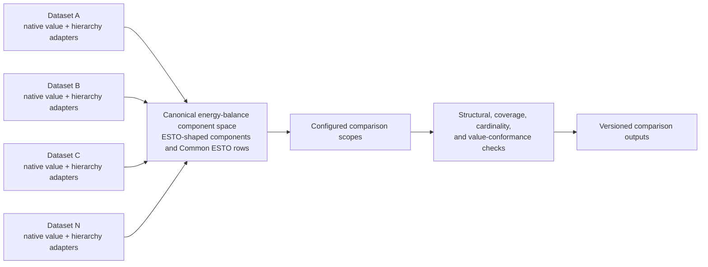
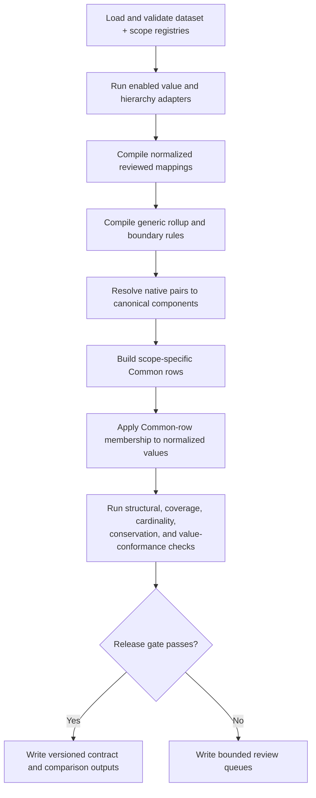
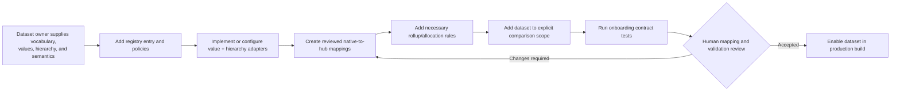

# Multi-dataset energy-balance mapping framework

**Status:** target architecture and migration contract; not yet an end-to-end
capability claim

**Audience:** mapping maintainers, dataset owners, reviewers, and agents

**Owner:** `leap_mappings`

**Last implementation review:** 2026-07-29

## Purpose

The intended framework must support **N energy-balance datasets**, not only the
current LEAP, ESTO, and 9th Outlook combination.

Supporting N datasets means that a new dataset can be registered, parsed,
mapped, rolled up, structurally classified, compared, validated, and published
without adding dataset-specific branches to the core engines. Dataset-specific
knowledge still has to exist, but it belongs in adapters and configuration.

This document defines that target and distinguishes it from what the repository
can do today.

## Current conclusion

The repository is **partly generalized but not yet plug-in ready**.

- The hierarchy/subtotal contract has a genuine adapter interface and a
  dataset-neutral classifier.
- Relationship artifacts already use broadly reusable `source_system`,
  `target_system`, flow, and product fields.
- Common ESTO application can concatenate multiple inputs after they have been
  converted into a common ESTO-shaped value schema.
- The workbook, use cases, rollup loaders, converters, comparison scopes,
  orchestration, and several validators still explicitly name the current
  datasets.

Adding a fourth dataset today would require coordinated Python and workbook
changes. It is therefore inaccurate to describe the whole pipeline as
N-dataset capable yet.

## The architectural decision

The framework should use a **canonical hub**, rather than require every dataset
to map directly to every other dataset.



With a hub, each dataset needs one maintained mapping route. An unrestricted
all-pairs design grows toward `N × (N - 1)` directional mapping surfaces and
allows the same semantic decision to be expressed differently in several
places.

The current ESTO/Common ESTO design is the practical starting hub:

- exact ESTO flow/product pairs act as canonical components;
- Common ESTO rows provide the comparison boundary when datasets have
  incompatible detail;
- source-native identities remain available through lineage;
- a future abstract component registry can replace ESTO-shaped identifiers
  only if a real limitation justifies that migration.

Direct mappings such as LEAP-to-9th may remain useful for special workflows,
but they are optional secondary views. They must not become a second source of
truth for hub membership.

## Terminology

| Term | Meaning |
|---|---|
| Dataset | A named energy-balance vocabulary and value source, such as ESTO, the 9th Outlook, or LEAP |
| Axis | One of the two category dimensions forming a balance pair; normally flow/sector and product/fuel |
| Native pair | One dataset's own axis-1/axis-2 combination |
| Canonical component | An exact hub flow/product pair |
| Common row | One exact component or a reviewed group of components that cannot safely be split for a comparison |
| Dataset adapter | Dataset-specific code that emits a required normalized contract |
| Mapping | A reviewed semantic relationship from a native pair to a target pair |
| Rollup | A reviewed rule that changes the effective comparison grain without changing raw source identity |
| Comparison scope | A named set of datasets and rules used to build one comparison view |
| Use case | The operational reason a relationship exists, such as balance conversion or model initialisation |

## Non-negotiable invariants

These rules apply regardless of how many datasets are registered:

1. **Mapping meaning is reviewed, not inferred from names alone.**
2. **The two axes are reasoned about independently.** A fuel match does not
   prove a sector/flow match.
3. **Raw source identity is preserved.** Conversion creates an effective view;
   it does not overwrite native rows.
4. **No false precision.** A source aggregate is not split across finer target
   rows without a reviewed allocation method and conservation evidence.
5. **Rollups are context-specific.** A rule safe for one comparison is not
   silently applied to every use case.
6. **Structural parenthood is stable.** A node with declared ordinary children
   remains a structural parent even when values do not add in a particular
   context.
7. **Structure and value conformance are separate.**
8. **Alternatives are non-additive.** Aliases, interim branches, and replacement
   structures must not both contribute to one additive frontier.
9. **Every output has provenance.** Dataset version, adapter version, mapping
   build, scope, inputs, and validation status are recorded.
10. **Consumers fail closed.** They do not silently substitute another mapping
    build, hierarchy build, or dataset vintage.
11. **Maintained mapping rows contain only relationships believed correct.**
    Rejected candidates remain in review evidence or Git history.
12. **Human decisions remain visible.** Exceptions require a reason, scope,
    owner, and review status.

## Target configuration model

### Dataset registry

The pipeline should read one authoritative registry rather than maintain
parallel hard-coded dataset lists.

Recommended location:

```text
config/datasets/dataset_registry.csv
```

Required fields:

| Field | Purpose |
|---|---|
| `dataset_id` | Stable machine identifier |
| `display_name` | Human-readable name |
| `enabled` | Whether the dataset participates in the selected build |
| `dataset_kind` | `observed`, `model`, `derived`, or `comparison` |
| `source_version` | Dataset vintage or build identifier |
| `value_adapter` | Registered value-adapter name |
| `hierarchy_adapter` | Registered hierarchy-adapter name |
| `axis_1_id` | Native flow/sector axis identifier |
| `axis_1_role` | Normally `flow` or `sector` |
| `axis_2_id` | Native product/fuel axis identifier |
| `axis_2_role` | Normally `product` or `fuel` |
| `canonical_target_dataset_id` | Normally the canonical component hub |
| `native_unit` | Declared source unit |
| `sign_convention_id` | Named sign-normalization policy |
| `scenario_policy_id` | Named scenario-normalization policy |
| `period_policy_id` | Named year/period-normalization policy |
| `subtotal_authority` | Where structural hierarchy truth comes from |
| `owner` | Dataset or mapping maintainer |
| `notes` | Human context, not executable logic |

Paths, column mappings, and parser options should live in a small
dataset-specific configuration file referenced by `dataset_id`. Secrets and
machine-local paths do not belong in the registry.

### Normalized value-adapter output

Every native value adapter must emit:

| Field | Meaning |
|---|---|
| `dataset_id` | Registered dataset |
| `source_version` | Dataset vintage |
| `economy` | Canonical economy identifier |
| `scenario` | Canonical scenario identifier |
| `year_or_period` | Canonical year or named period |
| `axis_1_node_id` | Native flow/sector node |
| `axis_2_node_id` | Native product/fuel node |
| `value` | Numeric value after declared unit/sign normalization |
| `unit` | Canonical output unit |
| `source_row_id` | Stable native-row identity where available |
| `provenance` | File, sheet, extraction, or source reference |

Adapters may retain extra native metadata in a separate lineage table. Core
mapping and validation functions must depend only on the normalized contract.

### Normalized hierarchy-adapter output

The existing hierarchy/subtotal contract is the target interface:

- dataset metadata;
- axis nodes;
- typed declared edges;
- observed native pairs;
- optional contextual value observations;
- provenance.

Ordinary hierarchy edges alone define structural parenthood. Aliases,
replacements, rollups, and graph-generated relationships remain separately
typed. See
[`hierarchy_subtotal_contract.md`](hierarchy_subtotal_contract.md).

### Normalized mapping relationship

The compiled relationship surface should be dataset-neutral:

| Field | Meaning |
|---|---|
| `relationship_id` | Stable identity |
| `use_case` | Operational purpose |
| `comparison_scope` | Optional scope restriction |
| `source_dataset_id` | Registered source |
| `source_axis_1_node_id` | Source flow/sector |
| `source_axis_2_node_id` | Source product/fuel |
| `target_dataset_id` | Registered target |
| `target_axis_1_node_id` | Target flow/sector |
| `target_axis_2_node_id` | Target product/fuel |
| `include_in_use_case` | Reviewed inclusion boolean |
| `relationship_type` | Direct, rollup-derived, replacement, alias, or allocation |
| `allocation_method` | Blank unless one-to-many allocation is intentional |
| `allocation_share` | Reviewed or generated share with provenance |
| `relationship_status` | Maintained review state |
| `source_mapping_file` | Workbook/config provenance |
| `source_sheet` | Human editing surface |
| `source_row_number` | Source-row provenance |
| `notes` | Decision explanation |

Existing human-friendly workbook sheets can remain during migration. A registry
should describe how each sheet maps into this normalized schema so the core
compiler does not know sheet-specific column names.

### Generic rollup rules

A normalized rollup rule requires:

| Field | Meaning |
|---|---|
| `rule_id` | Stable identity |
| `dataset_id` | Dataset whose native/effective pair is changed |
| `use_case` | Operational purpose |
| `comparison_scope` | Optional scope |
| `input_axis_1_node_id` | Input flow/sector |
| `input_axis_2_node_id` | Optional input product/fuel |
| `output_axis_1_node_id` | Rolled flow/sector |
| `output_axis_2_node_id` | Optional rolled product/fuel |
| `rollup_mode` | Additive, non-expanding, detached, or boundary adjustment |
| `include` | Reviewed activation boolean |
| `reason` | Semantic explanation |

The current separate LEAP, ESTO, and 9th rollup sheets can remain as editing
views, but their loaders should normalize into this one contract.

### Comparison-scope registry

Comparison scopes must be configuration, not Python constants.

Recommended location:

```text
config/datasets/comparison_scopes.csv
```

Each scope declares:

| Field | Meaning |
|---|---|
| `comparison_scope` | Stable scope identifier |
| `enabled` | Available to the current build |
| `default_enabled` | Selected by the standard pipeline run |
| `default_order` | Stable standard-build order for enabled defaults |
| `canonical_component_dataset_id` | Hub component vocabulary |
| `included_dataset_ids` | Registered sources admitted to the scope |
| `use_cases` | Relationship purposes used to build membership |
| `aggregate_constraint_dataset_ids` | Datasets whose aggregates constrain graph partitioning |
| `scenario_alignment_policy` | How scenarios are compared |
| `period_alignment_policy` | How years/periods are compared |
| `notes` | Human explanation |

Unknown datasets must not be silently included. A scope admits only its
declared sources.

## Target pipeline



### Stage responsibilities

| Stage | Dataset-neutral responsibility |
|---|---|
| Registration | Validate unique IDs, adapters, policies, paths, versions, and scope references |
| Native adaptation | Convert values and hierarchy into normalized contracts |
| Relationship compilation | Compile every configured mapping surface into one relationship schema |
| Structural resolution | Apply reviewed rollups and resolve source pairs to canonical components |
| Common-row construction | Find the finest safe scope-specific partition without splitting source aggregates |
| Value application | Aggregate normalized source values into Common rows |
| Validation | Check coverage, cardinality, hierarchy, additive frontiers, conservation, and value conformance |
| Publication | Write a manifest-bound artifact set with explicit validation status |

## Current implementation boundary

| Area | Reusable foundation | Remaining hard-coding |
|---|---|---|
| Relationship model | Generic source/target system and pair columns; stable relationship IDs | Fixed mapping sheets, use cases, column candidates, QA names, and current-dataset summaries |
| Rollups | Rules compile into effective relationships | Separate LEAP, ESTO, and 9th loaders and code paths |
| Common structure | Graph partitioning operates on canonical ESTO components and source aggregate constraints | Comparison-scope dictionaries explicitly list current systems and use cases |
| Value application | ESTO-shaped tables can be concatenated by `source_system` | Relevance policy and several review routes explicitly recognize ESTO, ESTO Extended, 9th, and LEAP |
| Hierarchy contract | Core consumes a list of normalized dataset adapters | Current registry explicitly constructs the known adapters and paths |
| Pipeline orchestration | Stages have clear boundaries | Separate LEAP and 9th converters; Stage 3 explicitly assembles known inputs and validation trees |
| Output contract | Long output retains `source_system` and provenance | Current allowed scopes and consumer expectations are based on the known systems |
| Tests | Strong focused coverage for current semantics | No fourth-dataset onboarding or registry-driven end-to-end test |

Relevant implementation entry points:

- `codebase/mapping_tools/build_energy_balance_relationships.py`;
- `codebase/mapping_tools/compile_structural_mapping_artifacts.py`;
- `codebase/mapping_tools/build_common_esto_structure.py`;
- `codebase/mapping_tools/apply_common_esto_structure.py`;
- `codebase/mapping_tools/hierarchy_subtotal_contract.py`;
- `codebase/mapping_tools/hierarchy_subtotal_adapters.py`;
- `codebase/run_mapping_pipeline.py`.

## Adding a dataset after the migration



The dataset owner must provide:

- axis definitions and complete observed-pair inventory;
- authoritative hierarchy or an explicit `partial_inventory` status;
- native unit and sign semantics;
- economy, scenario, and time coverage;
- subtotal evidence and source flags;
- reviewed mappings or a bounded mapping review queue;
- allocation evidence for any source-to-many-target relationship;
- named exclusions for deliberately out-of-scope rows.

Generated mapping candidates remain review-only. Registration does not grant
permission to insert inferred relationships into the maintained mapping
workbook.

## Fourth-dataset acceptance test

The generalization is not complete until a fourth dataset passes an end-to-end
test without dataset-specific branches in core engines.

Use a small synthetic fixture, for example `SYNTH_BALANCE`, containing:

- two economies;
- two scenarios;
- three years;
- a flow hierarchy with one parent and two children;
- a product hierarchy with one parent and two children;
- one direct mapping;
- one coarse source aggregate requiring a Common-row rollup;
- one intentionally unmapped pair;
- one value-conformance failure;
- one allocation-required mapping that remains blocked.

Acceptance criteria:

1. the registry loads it without changing core dataset lists;
2. its value adapter produces the normalized long schema;
3. its hierarchy adapter appears in the contract manifest;
4. structural parenthood follows declared ordinary edges;
5. its mappings compile from configured sheet/table metadata;
6. its rollup compiles through the generic rule schema;
7. a configured comparison scope admits it explicitly;
8. Common-row construction does not split its source aggregate;
9. Stage 3 publishes its `source_system` rows with lineage;
10. the intentionally unmapped pair appears in a bounded review file;
11. the value-conformance failure remains a failure without changing
    structural status;
12. disabling the registry row removes it cleanly without changing current
    LEAP/ESTO/9th outputs.

The regression test must also prove byte- or row-equivalent outputs for the
existing enabled datasets, apart from intentional manifest/configuration
additions.

## Migration sequence

The migration should be incremental. Do not replace all current workbook and
pipeline behavior in one change.

### M0 — Contract and baseline

- accept this document as the target;
- capture representative Stage 1–3 output hashes, schemas, row counts, and
  validation summaries;
- identify current use-case and comparison-scope owners.

### M1 — Introduce registries without changing behavior

- register ESTO, ESTO Extended, 9th, LEAP, and Common ESTO;
- register the existing comparison scopes;
- validate registry references;
- keep current execution functions underneath the registry entries.

Verification: existing outputs remain equivalent.

Implementation status (2026-07-29): the dataset and comparison-scope
registries, fail-closed loaders, legacy comparison-scope views, and
registry-filtered hierarchy-adapter list are implemented. Focused equivalence
tests preserve all six scope definitions, the four-scope standard build order,
and the established hierarchy-adapter order. Representative Stage 1–3 output
hash capture remains the M0 release gate; until that evidence is recorded, M1
is implemented but not declared release-complete.

### M2 — Normalize mapping-sheet configuration

- move `SHEET_CONFIGS` and sheet-column interpretations into configuration;
- compile the three current mapping sheets through the generic relationship
  schema;
- preserve workbook formatting and the human editing experience.

Verification: relationship IDs, use-case inclusion, and QA outputs remain
equivalent.

### M3 — Normalize rollup configuration

- compile LEAP, ESTO, and 9th rule sheets through the generic rollup schema;
- remove dataset branches from the structural compiler;
- preserve typed non-expanding, detached, and boundary-adjustment behavior.

Verification: rolled relationships and Common-row membership remain
equivalent.

### M4 — Register value converters

- wrap current LEAP, 9th, ESTO, and ESTO Extended preparation as registered
  value adapters;
- have orchestration iterate enabled datasets;
- retain optimized dataset-specific parsing inside adapters.

Verification: normalized source values and lineage remain equivalent.

### M5 — Complete registry-driven validators

- remove remaining fixed dataset lists and source-name branches from
  validators;
- consume the registered value adapters added in M4 throughout validation;
- route mapping-review findings through registry metadata rather than
  source-name conditionals.

Verification: current validation status and failure ownership remain
equivalent.

### M6 — Add the synthetic fourth dataset

- implement the acceptance fixture above;
- do not add its name to core relationship, partitioning, application, or
  validation functions;
- resolve every failure exposed by the onboarding test.

### M7 — Onboard the first real additional dataset

- use the same documented procedure;
- record time, manual decisions, missing extension points, and review burden;
- revise the contract only where real evidence shows it is insufficient.

## Compatibility and release policy

- Current workbook sheets remain authoritative until their generic
  replacements have passed equivalence checks.
- Registry introduction must not silently rename source systems, relationship
  IDs, Common-row IDs, comparison scopes, or dashboard fields.
- A migration stage that changes semantic membership requires human review; a
  mechanical refactor must demonstrate equivalence.
- Manifests record registry and adapter versions.
- A consumer that does not recognize a dataset or schema version fails with an
  actionable message.
- Partial dataset support is declared explicitly. A dataset is not “supported”
  merely because its values can be concatenated into Stage 3.

## Human decisions required before core refactoring

1. Confirm that ESTO-shaped canonical components remain the hub for the first
   generalization.
2. Decide whether direct non-hub mappings remain maintained comparison views or
   become generated diagnostics.
3. Approve the registry storage format and ownership.
4. Define scenario-alignment policy when datasets have different scenarios.
5. Define time-alignment policy for historical, projection, and irregular
   periods.
6. Define the allowed allocation methods and evidence threshold.
7. Decide whether unit normalization occurs inside every adapter or through a
   shared unit service after adaptation.
8. Select the first real fourth dataset only after the synthetic acceptance
   test passes.

## Out of scope

This design does not promise:

- automatic semantic mapping from similar labels;
- automatic approval of generated candidates;
- arbitrary pairwise comparison between every dataset;
- automatic allocation of coarse source values to finer targets;
- inference of structural hierarchy from numerical additivity;
- a universal dashboard page for every newly registered dataset;
- support for non-energy tables that do not fit two-axis balance semantics.

Those can be separate reviewed extensions. They are not prerequisites for an
N-dataset energy-balance mapping framework.

## Definition of done

The repository may describe itself as N-dataset capable only when:

- a dataset and comparison-scope registry controls the enabled build;
- core relationship, rollup, Common-row, application, and validation engines
  contain no current-dataset branches;
- native knowledge is isolated in registered adapters and reviewed mapping
  configuration;
- the synthetic fourth dataset passes the complete acceptance test;
- existing datasets pass equivalence and regression checks;
- onboarding instructions can be followed by a person or agent without
  discovering undocumented Python edits;
- manifests and review outputs make partial, failed, stale, and unavailable
  status explicit.

Until then, this document is the migration contract and the current
LEAP/ESTO/9th pipeline remains the supported production surface.
