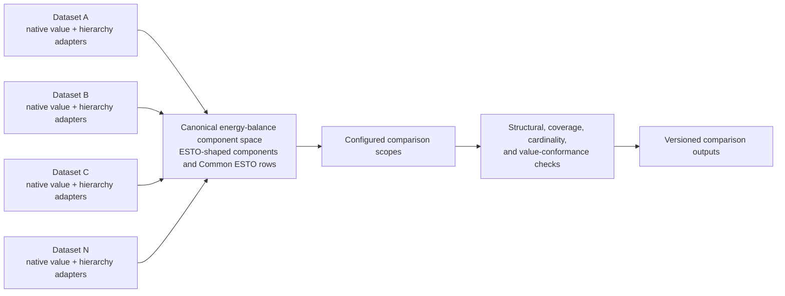
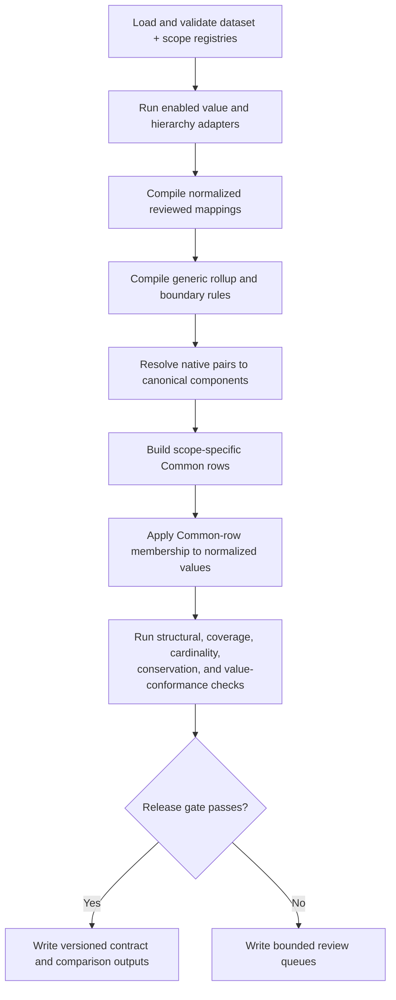
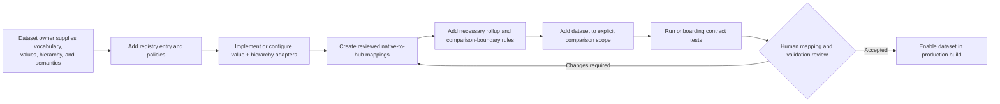

# Multi-dataset energy-balance mapping framework

**Status:** registry-driven four-source production capability plus remaining
N-dataset migration contract

**Audience:** mapping maintainers, dataset owners, reviewers, and agents

**Owner:** `leap_mappings`

**Last implementation review:** 2026-07-30

## Purpose

The intended framework must support **N energy-balance datasets**, not only the
current LEAP, ESTO, and 9th Outlook combination.

Supporting N datasets means that a new dataset can be registered, parsed,
mapped, rolled up, structurally classified, compared, validated, and published
without adding dataset-specific branches to the core engines. Dataset-specific
knowledge still has to exist, but it belongs in adapters and configuration.

This document defines that target and distinguishes it from what the repository
can do today.

## Current conclusion

The repository is **production-capable for the registered ESTO, ESTO Extended,
LEAP, and Ninth sources, but not yet plug-in ready for an arbitrary new
dataset**.

- The hierarchy/subtotal contract has a genuine adapter interface and a
  dataset-neutral classifier.
- Relationship artifacts already use broadly reusable `source_system`,
  `target_system`, flow, and product fields.
- Common ESTO application can concatenate multiple inputs after they have been
  converted into a common ESTO-shaped value schema.
- The separate-axis refresh is now the production first step. People maintain
  six single-axis relation sheets and four accepted-extra-pair sheets in
  `config/outlook_mappings_single_axis.xlsx`; the pipeline generates exact-pair
  authority and the compatibility `outlook_mappings_master.xlsx` consumed by
  existing stages.
- The 2026-07-30 full production run rebuilt all four default comparison
  scopes, preserved mapped value in every scope/source combination, and
  delivered every mapped source pair to at most one additive Common row.
- Workbook row schemas, the use-case catalogue, rollup loaders, converters,
  orchestration, and several validators still explicitly name the current
  datasets. Dataset identity, comparison scopes, hierarchy-adapter selection,
  and mapping-sheet column interpretation now come from validated registries.

Adding a fourth dataset today would require coordinated Python and workbook
changes. It is therefore inaccurate to describe the whole pipeline as
N-dataset capable yet.

## The architectural decision

The framework should use a **canonical hub**, rather than require every dataset
to map directly to every other dataset.



With a hub, each dataset needs one maintained mapping route. An unrestricted
all-pairs design grows toward `N × (N - 1)` directional mapping surfaces and
allows the same semantic decision to be expressed differently in several
places.

The current ESTO/Common ESTO design is the practical starting hub:

- exact ESTO flow/product pairs act as canonical components;
- Common ESTO rows provide the comparison boundary when datasets have
  incompatible detail;
- source-native identities remain available through lineage;
- a future abstract component registry can replace ESTO-shaped identifiers
  only if a real limitation justifies that migration.

Direct LEAP-to-9th mappings are transitional secondary diagnostics, not a
source of truth for hub membership. They may remain while the 9th Outlook is an
active comparison source, but the architecture must allow them to be removed
cleanly when that dataset becomes obsolete. No new core capability should
depend on the direct LEAP-to-9th surface.

## Terminology

| Term | Meaning |
|---|---|
| Dataset | A named energy-balance vocabulary and value source, such as ESTO, the 9th Outlook, or LEAP |
| Axis | One of the two category dimensions forming a balance pair; normally flow/sector and product/fuel |
| Native pair | One dataset's own axis-1/axis-2 combination |
| Canonical component | An exact hub flow/product pair |
| Common row | One exact component or a reviewed group of components that cannot safely be split for a comparison |
| Dataset adapter | Dataset-specific code that emits a required normalized contract |
| Mapping | A reviewed semantic relationship from a native pair to a target pair |
| Rollup | A reviewed rule that changes the effective comparison grain without changing raw source identity |
| Comparison scope | A named set of datasets and rules used to build one comparison view |
| Use case | The operational reason a relationship exists, such as balance conversion or model initialisation |

## Non-negotiable invariants

These rules apply regardless of how many datasets are registered:

1. **Mapping meaning is reviewed, not inferred from names alone.**
2. **The two axes are reasoned about independently.** A fuel match does not
   prove a sector/flow match.
3. **Raw source identity is preserved.** Conversion creates an effective view;
   it does not overwrite native rows.
4. **No false precision.** A source aggregate is not split across finer target
   rows by `leap_mappings`. Detailed datasets are rolled up to a safe shared
   comparison grain; reconstructing detail from a coarse source belongs to a
   downstream application.
5. **Rollups are context-specific.** A rule safe for one comparison is not
   silently applied to every use case.
6. **Structural parenthood is stable.** A node with declared ordinary children
   remains a structural parent even when values do not add in a particular
   context.
7. **Structure and value conformance are separate.**
8. **Alternatives are non-additive.** Aliases, interim branches, and replacement
   structures must not both contribute to one additive frontier.
9. **Every output has provenance.** Dataset version, adapter version, mapping
   build, scope, inputs, and validation status are recorded.
10. **Consumers fail closed.** They do not silently substitute another mapping
    build, hierarchy build, or dataset vintage.
11. **Maintained mapping rows contain only relationships believed correct.**
    Rejected candidates remain in review evidence or Git history.
12. **Human decisions remain visible.** Exceptions require a reason, scope,
    owner, and review status.

## Target configuration model

### Dataset registry

The pipeline should read one authoritative registry rather than maintain
parallel hard-coded dataset lists.

Recommended location:

```text
config/datasets/dataset_registry.csv
```

Required fields:

| Field | Purpose |
|---|---|
| `dataset_id` | Stable machine identifier |
| `display_name` | Human-readable name |
| `enabled` | Whether the dataset participates in the selected build |
| `dataset_kind` | `observed`, `model`, `derived`, or `comparison` |
| `source_version` | Dataset vintage or build identifier |
| `value_adapter` | Registered value-adapter name |
| `hierarchy_adapter` | Registered hierarchy-adapter name |
| `axis_1_id` | Native flow/sector axis identifier |
| `axis_1_role` | Normally `flow` or `sector` |
| `axis_2_id` | Native product/fuel axis identifier |
| `axis_2_role` | Normally `product` or `fuel` |
| `canonical_target_dataset_id` | Normally the canonical component hub |
| `native_unit` | Declared source unit |
| `sign_convention_id` | Named sign-normalization policy |
| `scenario_policy_id` | Named scenario-normalization policy |
| `period_policy_id` | Named year/period-normalization policy |
| `subtotal_authority` | Where structural hierarchy truth comes from |
| `owner` | Optional responsible operator, user, or role for the current entry |
| `notes` | Human context, not executable logic |

Paths, column mappings, and parser options should live in a small
dataset-specific configuration file referenced by `dataset_id`. Secrets and
machine-local paths do not belong in the registry.

### Normalized value-adapter output

Every native value adapter must emit:

| Field | Meaning |
|---|---|
| `dataset_id` | Registered dataset |
| `source_version` | Dataset vintage |
| `economy` | Canonical economy identifier |
| `scenario` | Canonical scenario identifier |
| `year_or_period` | Canonical year or named period |
| `axis_1_node_id` | Native flow/sector node |
| `axis_2_node_id` | Native product/fuel node |
| `value` | Numeric value after declared unit/sign normalization |
| `unit` | Canonical output unit |
| `source_row_id` | Stable native-row identity where available |
| `provenance` | File, sheet, extraction, or source reference |

Adapters may retain extra native metadata in a separate lineage table. Core
mapping and validation functions must depend only on the normalized contract.
The mapping core accepts values in PJ. If a native dataset uses another unit,
its ingestion/adaptation boundary must convert it to PJ before emitting this
contract; the mapping, Common-row, and validation engines do not perform
implicit unit conversion.

### Normalized hierarchy-adapter output

The existing hierarchy/subtotal contract is the target interface:

- dataset metadata;
- axis nodes;
- typed declared edges;
- observed native pairs;
- optional contextual value observations;
- provenance.

Ordinary hierarchy edges alone define structural parenthood. Aliases,
replacements, rollups, and graph-generated relationships remain separately
typed. See
[`hierarchy_subtotal_contract.md`](hierarchy_subtotal_contract.md).

### Normalized mapping relationship

The compiled relationship surface should be dataset-neutral:

| Field | Meaning |
|---|---|
| `relationship_id` | Stable identity |
| `use_case` | Operational purpose |
| `comparison_scope` | Optional scope restriction |
| `source_dataset_id` | Registered source |
| `source_axis_1_node_id` | Source flow/sector |
| `source_axis_2_node_id` | Source product/fuel |
| `target_dataset_id` | Registered target |
| `target_axis_1_node_id` | Target flow/sector |
| `target_axis_2_node_id` | Target product/fuel |
| `include_in_use_case` | Reviewed inclusion boolean |
| `relationship_type` | Direct, rollup-derived, replacement, or alias |
| `allocation_method` | Optional downstream metadata; not executed by the mapping core |
| `allocation_share` | Optional downstream metadata with provenance; never inferred or applied by the mapping core |
| `relationship_status` | Maintained review state |
| `source_mapping_file` | Workbook/config provenance |
| `source_sheet` | Human editing surface |
| `source_row_number` | Source-row provenance |
| `notes` | Decision explanation |

Existing human-friendly workbook sheets can remain during migration. A registry
should describe how each sheet maps into this normalized schema so the core
compiler does not know sheet-specific column names.

### Comparison grain and downstream disaggregation

When a newly registered dataset is coarser than ESTO, LEAP, or another source,
`leap_mappings` does not attempt to expand its values. Instead:

1. each coarse native pair maps to an appropriate coarse hub component or
   reviewed Common row;
2. the more detailed datasets roll up to that same comparison boundary;
3. the coarse source value remains unchanged;
4. detailed source identity remains available through lineage; and
5. totals are checked before and after the detailed-to-coarse rollup.

This is the expected behavior for the synthetic simpler dataset. Its ESTO
parent fuels and simplified flows define the comparison grain, so the other
datasets are rolled up substantially to match it.

A downstream consumer may choose to reverse that relationship and distribute a
coarse value over detailed categories. That operation needs allocation shares,
context, evidence, conservation checks, and double-counting protection, but it
is not performed by `leap_mappings`. The mapping outputs may expose the
parent/child relationships and lineage needed by such an application without
claiming that the reverse allocation is unique or approved.

### Generic rollup rules

A normalized rollup rule requires:

| Field | Meaning |
|---|---|
| `rule_id` | Stable identity |
| `dataset_id` | Dataset whose native/effective pair is changed |
| `use_case` | Operational purpose |
| `comparison_scope` | Optional scope |
| `input_axis_1_node_id` | Input flow/sector |
| `input_axis_2_node_id` | Optional input product/fuel |
| `output_axis_1_node_id` | Rolled flow/sector |
| `output_axis_2_node_id` | Optional rolled product/fuel |
| `rollup_mode` | Additive, non-expanding, detached, or boundary adjustment |
| `include` | Reviewed activation boolean |
| `reason` | Semantic explanation |

The current separate LEAP, ESTO, and 9th rollup sheets can remain as editing
views, but their loaders should normalize into this one contract.

### Comparison-scope registry

Comparison scopes must be configuration, not Python constants.

Recommended location:

```text
config/datasets/comparison_scopes.csv
```

Each scope declares:

| Field | Meaning |
|---|---|
| `comparison_scope` | Stable scope identifier |
| `enabled` | Available to the current build |
| `default_enabled` | Selected by the standard pipeline run |
| `default_order` | Stable standard-build order for enabled defaults |
| `canonical_component_dataset_id` | Hub component vocabulary |
| `included_dataset_ids` | Registered sources admitted to the scope |
| `use_cases` | Relationship purposes used to build membership |
| `aggregate_constraint_dataset_ids` | Datasets whose aggregates constrain graph partitioning |
| `scenario_alignment_policy` | How scenarios are compared |
| `period_alignment_policy` | How years/periods are compared |
| `notes` | Human explanation |

Unknown datasets must not be silently included. A scope admits only its
declared sources.

Scenario and period alignment are also scope configuration:

- scenario labels do not have to match between datasets;
- a scope may explicitly pair any scenario from one dataset with any scenario
  from another dataset;
- pairings must be declared rather than inferred from equal names or emitted as
  an uncontrolled Cartesian product;
- period rules are scope-specific because base years, projection starts, and
  comparison horizons can change between builds;
- manifests record the applied scenario and period policy versions.

## Target pipeline



### Stage responsibilities

| Stage | Dataset-neutral responsibility |
|---|---|
| Registration | Validate unique IDs, adapters, policies, paths, versions, and scope references |
| Native adaptation | Convert values and hierarchy into normalized contracts |
| Relationship compilation | Compile every configured mapping surface into one relationship schema |
| Structural resolution | Apply reviewed rollups and resolve source pairs to canonical components |
| Common-row construction | Find the finest safe scope-specific partition without splitting source aggregates |
| Value application | Aggregate normalized source values into Common rows |
| Validation | Check coverage, cardinality, hierarchy, additive frontiers, conservation, and value conformance |
| Publication | Write a manifest-bound artifact set with explicit validation status |

## Current implementation boundary

| Area | Reusable foundation | Remaining hard-coding |
|---|---|---|
| Relationship model | Generic source/target system and pair columns; stable relationship IDs; registered workbook-sheet or CSV-table direction and column candidates | QA names and several current-dataset summaries |
| Rollups | Rules compile into effective relationships | Separate LEAP, ESTO, and 9th loaders and code paths |
| Common structure | Graph partitioning operates on canonical ESTO components and registry-defined source aggregate constraints | Some structural and validation helpers retain current-source assumptions |
| Value application | Registered Stage 3 source tables are concatenated by `source_system`; normalized PJ tables can use the generic passthrough adapter | Relevance policy and several review routes explicitly recognize ESTO, ESTO Extended, 9th, and LEAP |
| Hierarchy contract | Core consumes normalized dataset adapters; reviewed CSV hierarchies use a generic adapter | Optimized current-source adapters and paths remain explicit registrations |
| Pipeline orchestration | Stages have clear boundaries and registered value execution/source discovery | Separate optimized native converters and current-source validation trees remain |
| Output contract | Long output retains `source_system` and provenance | Current allowed scopes and consumer expectations are based on the known systems |
| Tests | Strong current-semantics coverage plus a passing registry-enabled synthetic fourth-dataset end-to-end acceptance run | A real additional dataset and reviewer remain an M7 input dependency |

Relevant implementation entry points:

- `codebase/mapping_tools/build_energy_balance_relationships.py`;
- `codebase/mapping_tools/compile_structural_mapping_artifacts.py`;
- `codebase/mapping_tools/build_common_esto_structure.py`;
- `codebase/mapping_tools/apply_common_esto_structure.py`;
- `codebase/mapping_tools/hierarchy_subtotal_contract.py`;
- `codebase/mapping_tools/hierarchy_subtotal_adapters.py`;
- `codebase/run_mapping_pipeline.py`.

## Adding a dataset after the migration



The dataset owner must provide:

- axis definitions and complete observed-pair inventory;
- authoritative hierarchy or an explicit `partial_inventory` status;
- native unit and sign semantics;
- economy, scenario, and time coverage;
- subtotal evidence and source flags;
- reviewed mappings or a bounded mapping review queue;
- enough hierarchy and mapping evidence to identify the safe shared comparison
  grain;
- named exclusions for deliberately out-of-scope rows.

Generated mapping candidates remain review-only. Registration does not grant
permission to insert inferred relationships into the maintained mapping
workbook.

## Fourth-dataset acceptance test

The generalization is not complete until a fourth dataset passes an end-to-end
test without dataset-specific branches in core engines.

Use a small synthetic fixture, for example `SYNTH_BALANCE`, that demonstrates
how a less detailed energy-balance system can still participate safely. Its
two axes use first-level ESTO flow and fuel categories. Values are aggregated
to those categories before entering the comparison, so the fixture contains no
invented coarse-to-detailed allocation. It contains:

- two economies;
- two scenarios;
- three years;
- a flow hierarchy with one parent and two children;
- a product hierarchy with one parent and two children;
- one direct mapping;
- one coarse source aggregate mapped to a coarse hub/Common-row boundary;
- one intentionally unmapped pair;
- one value-conformance failure;
- detailed hub pairs that must roll up to the synthetic dataset's coarse
  comparison boundary.

Acceptance criteria:

1. the registry loads it without changing core dataset lists;
2. its value adapter produces the normalized long schema;
3. its hierarchy adapter appears in the contract manifest;
4. structural parenthood follows declared ordinary edges;
5. its mappings compile from configured sheet/table metadata;
6. any new rollup it requires compiles through the generic rule schema (the
   first-level fixture deliberately requires none because existing detailed
   hub relationships already resolve its coarse boundary);
7. a configured comparison scope admits it explicitly;
8. Common-row construction does not split its source aggregate;
9. Stage 3 publishes its `source_system` rows with lineage;
10. the intentionally unmapped pair appears in a bounded review file;
11. the value-conformance failure remains a failure without changing
    structural status;
12. disabling the registry row removes it cleanly without changing current
    LEAP/ESTO/9th outputs.

The regression test must also prove byte- or row-equivalent outputs for the
existing enabled datasets, apart from intentional manifest/configuration
additions.

## Migration sequence

The migration should be incremental. Do not replace all current workbook and
pipeline behavior in one change.

### M0 — Contract and baseline

- accept this document as the target;
- capture representative Stage 1–3 output hashes, schemas, row counts, and
  validation summaries;
- identify current use-case and comparison-scope owners.

Implementation status (2026-07-29): reproducible baseline-capture tooling is
implemented. Fresh Stage 1 and Stage 2 evidence can be captured in the isolated
worktree. The latest available Stage 3 artifacts are retained as explicitly
historical reference evidence because they predate this branch and include
known failed validations.

A fresh Stage 3 application and Common hierarchy-validation pass has now been
run in the isolated worktree. The application contract passed, but the deep
flow hierarchy check remains semantically non-clean: 1,622 eligible checks
produced 479 mismatches (ESTO 78, ESTO Extended 97, LEAP 0, and NINTH 304).
The declared-rollup pass performed 163,674 checks, with 19,624 passed, 4
failed, 101,991 incomplete-contributor results, and 42,055 cases with no
contributors available. Product hierarchy checks had no eligible parents and
were explicitly skipped. The source-parent anchor phase has now also been
rerun against the fresh compressed Stage 3 fact artifact using the
base-year-plus-decade validation slice. It produced 217,099 eligible checks:
209,837 passed and 7,262 failed, with 1,137,515 explicitly skipped contexts.
Ten of twelve axis/scope/source summaries remain failed; both ESTO product
summaries now pass. The compact reviewer output contains 11,384 rows (7,262
failed and 4,122 skipped review records). Its summary SHA-256 is
`f02b9fa4ebc74216608acb6db66b9c8ab609d97a5a0526cd1b44ccddcc454319`.
M0 therefore remains a failed/incomplete semantic release gate rather than
being promoted on the strength of the clean application contract.

### M1 — Introduce registries without changing behavior

- register ESTO, ESTO Extended, 9th, LEAP, and Common ESTO;
- register the existing comparison scopes;
- validate registry references;
- keep current execution functions underneath the registry entries.

Verification: existing outputs remain equivalent.

Implementation status (2026-07-29): the dataset and comparison-scope
registries, fail-closed loaders, legacy comparison-scope views, and
registry-filtered hierarchy-adapter list are implemented. Focused equivalence
tests preserve all six scope definitions, the four-scope standard build order,
and the established hierarchy-adapter order. Representative Stage 1–3 output
hash capture remains the M0 release gate; until that evidence is recorded, M1
is implemented but not declared release-complete.

### M2 — Normalize mapping-sheet configuration

- move `SHEET_CONFIGS` and sheet-column interpretations into configuration;
- compile the three current mapping sheets through the generic relationship
  schema;
- preserve workbook formatting and the human editing experience.

Verification: relationship IDs, use-case inclusion, and QA outputs remain
equivalent.

Implementation status (2026-07-29): the three maintained workbook sheets now
compile through `config/datasets/mapping_sheet_registry.csv`. The registry
declares source/target datasets, ordered column candidates, enablement, and
use-case membership while preserving the workbook as the human editing
surface. Stage 1 equivalence is byte-exact:

- `energy_balance_relationships.csv`: 17,076 rows,
  SHA-256 `cb720326e793e4ced916df2c7c72607ede68821a6c18a8c2e007a27979ad35c4`;
- `relationship_catalogue_6_col.csv`: 6,466 rows,
  SHA-256 `1b8ff4b29c3eea31befc89c9f2b001b24d075c4d9ce5c5a5f117293d2d1710ef`;
- one-to-many allocation/combined-target QA: zero rows,
  SHA-256 `7eb70257593da06f682a3ddda54a9d260d4fc514f645237f5ca74b08f8da61a6`.

The legacy `SHEET_CONFIGS` public shape remains available for existing callers.

### M3 — Normalize rollup configuration

- compile LEAP, ESTO, and 9th rule sheets through the generic rollup schema;
- remove dataset branches from the structural compiler;
- preserve typed non-expanding, detached, and boundary-adjustment behavior.

Verification: rolled relationships and Common-row membership remain
equivalent.

Implementation status (2026-07-29): the three current rollup sheets are
declared in `config/datasets/rollup_sheet_registry.csv` and compile to one
normalized rule schema. Stage 1 emitted 133 active normalized contributor
rules: 68 LEAP, 38 ESTO, and 27 9th rows across expanding, non-expanding, and
detached modes. Existing rollup consumers retain their prior raw DataFrame
views during migration. The complete 17,076-row relationship output remained
byte-identical to the M0 baseline SHA-256
`cb720326e793e4ced916df2c7c72607ede68821a6c18a8c2e007a27979ad35c4`.

### M4 — Register value converters

- wrap current LEAP, 9th, ESTO, and ESTO Extended preparation as registered
  value adapters;
- have orchestration iterate enabled datasets;
- retain optimized dataset-specific parsing inside adapters.

Verification: normalized source values and lineage remain equivalent.

Implementation status (2026-07-29): the four current native value preparations
are registered in `config/datasets/value_adapter_registry.csv`. The registry
controls adapter execution order and Stage 3 source-artifact discovery while
the existing optimized ESTO, ESTO Extended, LEAP, and 9th converter functions
remain the adapter implementations. Pipeline imports also resolve the canonical
LEAP-export directory correctly from an isolated Git worktree.

### M5 — Complete registry-driven validators

- remove remaining fixed dataset lists and source-name branches from
  validators;
- consume the registered value adapters added in M4 throughout validation;
- route mapping-review findings through registry metadata rather than
  source-name conditionals.

Verification: current validation status and failure ownership remain
equivalent.

Implementation status (2026-07-29): the shared validation and structural
compilation paths now obtain:

- mapping-review destinations and source/target columns from the mapping-sheet
  registry;
- source comparison-frontier membership and diagnostic value paths from
  enabled dataset and value-adapter rows;
- latest-year, projection-start, or all-period relevance evidence from
  per-adapter policy rather than source-name branches;
- source-specific parent exclusions from a named validation adapter;
- structural source systems, rollup columns, and canonical identity sources
  from the dataset, rollup, and value-adapter registries.

The current ESTO/NINTH/LEAP diagnostic column names and ordering remain
compatible. With the synthetic dataset enabled, the same machinery adds
`synth_balance_*` evidence without changing core code. Focused tests pass and
fresh disabled-dataset Stages 1 and 2 remain byte-identical to M0: 17,076
relationships and 10,044 Common rows.

The optional unmapped-source indirect-chain diagnostic is now exposed through
`config/datasets/diagnostic_adapter_registry.csv`. Its current registered
implementation remains deliberately LEAP-specific and follows the transitional
LEAP-to-9th-to-ESTO chain, but Stage 3 invokes it by adapter name and obtains
the three mapping surfaces from registry fields rather than embedding their
sheet names in orchestration. Disabling its registry row suppresses the
diagnostic without a Python edit.

M5 registry migration and real-data execution verification are complete. The
fresh source-parent run retained the established failure ownership: LEAP and
NINTH flow anchors and NINTH product anchors remain failed, while ESTO product
anchors pass. Counts changed from the historical run because the fresh Common
structure and current rollup fixes admit more eligible contexts; this is not
reported as byte equivalence. The current semantic release gate remains failed
and belongs to mapping/hierarchy review, not to the registry refactor.

A fresh real-data Stage 3 application smoke run completed after this refactor
using the current 10,044-row Common structure and the latest available
converted ESTO, ESTO Extended, LEAP, and 9th artifacts. The isolated run:

- read 17,855,594 normalized source rows after configured unmodelled-row
  exclusions;
- published 3,952,646 fact rows and 6,173 Common-row metadata rows;
- retained all four production source systems and all four default comparison
  scopes;
- reported 100% mapped-row aggregation preservation for every scope/source
  combination, with maximum absolute floating-point difference
  `1.1641532182693481e-10`;
- published a passed output contract whose compressed fact SHA-256 is
  `8524184927a161637c45a04dd48b5f0dc4cea96fe5e757ce411e8f65891d77b5`.

This application/output-contract smoke run was followed by both the fresh
Common hierarchy pass and the source-parent anchor run summarized under M0.
The complete current evidence therefore distinguishes a clean application
contract from known non-clean hierarchy and anchor semantics.

### M6 — Add the synthetic fourth dataset

- implement the acceptance fixture above;
- do not add its name to core relationship, partitioning, application, or
  validation functions;
- resolve every failure exposed by the onboarding test.

Implementation status (2026-07-29): `SYNTH_BALANCE` is present in the dataset,
scope, mapping-sheet, and value-adapter registries but disabled by default. Its
maintained fixture uses first-level ESTO categories, two economies, two
independently named scenarios, and three years. Generic reviewed-CSV hierarchy,
reviewed-CSV mapping-table, and normalized-PJ value adapters allow it to be
enabled through copied registries without a dataset-name branch. Tests prove
that:

- a 100 PJ coarse synthetic row compares with detailed ESTO rows of 60 PJ and
  40 PJ in one conserved Common row without coarse-to-detailed allocation;
- the source aggregate is not split;
- mapped Stage 3-style rows retain source and aggregate-group lineage;
- the deliberately unmapped first-level pair produces a bounded review set;
- missing child observations remain `children_incomplete` value-conformance
  evidence without changing structural parenthood;
- disabling the registry rows preserves the production Stage 1 relationship
  output byte-for-byte at 17,076 rows and SHA-256
  `cb720326e793e4ced916df2c7c72607ede68821a6c18a8c2e007a27979ad35c4`.

The fixture now has a notebook-safe end-to-end runner at
`codebase/synthetic_multi_dataset_acceptance_workflow.py`. Run ID
`synthetic_multi_dataset_acceptance_v1` passed all twelve specified acceptance
criteria plus a mapped-value conservation invariant:

- the copied registries enabled the dataset, scope, mapping table, value
  adapter, and hierarchy adapter without changing production configuration,
  and the value-application/check paths consumed that copied scope membership
  explicitly rather than admitting an unknown scope by fallback;
- the reviewed mapping CSV compiled to 6 relationship/use-case rows;
- the declared hierarchy published 4 ordinary edges and retained
  `children_incomplete` as value-conformance evidence;
- 3 canonical components formed one unsplit coarse Common row;
- Stage 3-style application published 15 rows across ESTO, LEAP, NINTH, and
  `SYNTH_BALANCE`;
- all 1,890 PJ of mapped synthetic input was conserved;
- the 12 deliberately unmapped economy/scenario/year contexts remained in the
  bounded missing-map review output; and
- the disabled production mapping surface remains tied to the byte-exact
  17,076-row Stage 1 baseline SHA-256
  `cb720326e793e4ced916df2c7c72607ede68821a6c18a8c2e007a27979ad35c4`.

The runnable evidence is written under
`results/multi_dataset_acceptance/synthetic_v1/`, including
`acceptance_checklist.csv`, `acceptance_summary.json`, the hierarchy contract,
Stage 2 QA, and the Stage 3 output contract. M6 is complete for the deliberately
small acceptance fixture; a production-scale real additional dataset belongs
to M7 rather than being a hidden extra condition on M6.

#### What the synthetic acceptance establishes

The successful `SYNTH_BALANCE` run is sufficient evidence for the framework
claim it was designed to test: a fourth, coarse, two-axis energy-balance
dataset can be registered, mapped through the ESTO-shaped hub, combined with
more detailed datasets at a conserved Common grain, and reported through the
existing pipeline without adding dataset-name branches to the core engines.
The fixture need not contain every first-level ESTO flow/product combination
to establish that architectural capability.

This is not a claim that every future dataset will onboard without semantic
work. The remaining risks are primarily decisions at the dataset boundary:

- **Choosing the comparison boundary.** A maintainer must understand whether a
  source row is an exact category, a hierarchy parent, a subtotal, or a
  dataset-specific aggregate before deciding where it belongs.
- **Placing rollups correctly.** A reviewed, manually specified rollup is
  appropriate when the required semantic boundary is known but is not already
  represented by the maintained hierarchy and mappings. Stage 2's automatic
  Common ESTO graph partitioning is different: it derives a safe shared grain
  from existing mapping constraints. It should not be used as a substitute for
  missing semantic knowledge.
- **Knowing when to leave a row unmapped.** An uncertain row should remain in a
  bounded review output when mapping it would invent meaning, cross a scope
  boundary, or imply a coarse-to-detailed allocation. Forced coverage is more
  dangerous than an explicit gap.
- **Hierarchy and subtotal interpretation.** A new source may use labels that
  resemble ESTO while applying different parent/child, subtotal, sign, or
  accounting rules. Those semantics require a knowledgeable reviewer.
- **Scope, scenario, and time alignment.** Successful ingestion does not decide
  which scenario pairs or year rules are meaningful. Those remain explicit,
  versioned scope configuration.
- **Scale.** The fixture validates behavior and conservation, not the runtime,
  memory use, or review burden of an arbitrarily large new dataset.

The operational distinction between manual rollup rules and automatic Common
ESTO aggregation is defined in
[mappings_system.md](mappings_system.md#manual-rollup-rules-vs-automatic-common-esto-aggregation).
Both mechanisms aggregate detailed values towards a safe coarse comparison
grain; neither disaggregates a coarse source value.

The broad regression run produced 397 passed and 1 skipped tests, with the same
two known failures seen before this work: one pre-existing LEAP
`source_context_status` expectation and one test whose ignored ESTO data file
is absent from the worktree. Two additional test modules cannot collect in this
isolated worktree because their import-time resolver requires the missing
sibling-worktree LEAP export directory. None of these four environment/legacy
issues exercises the multi-dataset changes.

### M7 — Onboard the first real additional dataset

- use the same documented procedure;
- record time, manual decisions, missing extension points, and review burden;
- revise the contract only where real evidence shows it is insufficient.

## Compatibility and release policy

- Current workbook sheets remain authoritative until their generic
  replacements have passed equivalence checks.
- Registry introduction must not silently rename source systems, relationship
  IDs, Common-row IDs, comparison scopes, or dashboard fields.
- A migration stage that changes semantic membership requires human review; a
  mechanical refactor must demonstrate equivalence.
- Manifests record registry and adapter versions.
- A consumer that does not recognize a dataset or schema version fails with an
  actionable message.
- Partial dataset support is declared explicitly. A dataset is not “supported”
  merely because its values can be concatenated into Stage 3.

## Confirmed human decisions

The following decisions were confirmed on 2026-07-29:

1. **Canonical hub:** ESTO-shaped components, including reviewed ESTO Extended
   categories where required by a scope, remain the first canonical hub.
2. **Direct LEAP-to-9th status:** direct mappings are secondary diagnostics.
   The hub route is authoritative, and direct 9th mappings may eventually be
   removed when the 9th Outlook becomes obsolete.
3. **Scenario alignment:** the framework must support an explicitly configured
   pairing between any scenario and any other scenario. It must not require
   matching scenario names.
4. **Time alignment:** base years and projection periods are governed by
   versioned, scope-specific rules rather than one global year intersection or
   a fixed projection boundary.
5. **Comparison direction:** `leap_mappings` rolls detailed datasets up to the
   safe grain of a coarse comparison dataset. It does not disaggregate the
   coarse dataset. Any downstream coarse-to-detailed allocation is a separate
   consumer responsibility requiring its own shares, provenance, and
   conservation evidence.
6. **Units:** the normalized mapping-system input is PJ. Non-PJ native data must
   be converted at the ingestion/adaptation boundary before it enters mapping,
   Common-row, or validation logic.
7. **Synthetic additional dataset:** the acceptance example uses first-level
   ESTO fuel and flow categories. Existing component mappings and rollups bring
   detailed datasets to that grain; new large rollups are added only where a
   required first-level boundary cannot be represented by the maintained
   hierarchy.
8. **Registry format and stewardship:** maintained dataset and scope registries
   use CSV files under `config/datasets/`. They do not require one permanent
   named owner. The owner or user operating the system is responsible for their
   changes, with Git history and review metadata preserving provenance.

## Remaining human decisions

1. **First real additional dataset:** select it only after the synthetic
   acceptance test passes, then provide a representative extract and a reviewer
   familiar with its balance semantics.

## Out of scope

This design does not promise:

- automatic semantic mapping from similar labels;
- automatic approval of generated candidates;
- arbitrary pairwise comparison between every dataset;
- automatic allocation of coarse source values to finer targets;
- inference of structural hierarchy from numerical additivity;
- a universal dashboard page for every newly registered dataset;
- support for non-energy tables that do not fit two-axis balance semantics.

Those can be separate reviewed extensions. They are not prerequisites for an
N-dataset energy-balance mapping framework.

## Definition of done

The repository may describe itself as N-dataset capable only when:

- a dataset and comparison-scope registry controls the enabled build;
- core relationship, rollup, Common-row, application, and validation engines
  contain no current-dataset branches;
- native knowledge is isolated in registered adapters and reviewed mapping
  configuration;
- the synthetic fourth dataset passes the complete acceptance test;
- existing datasets pass equivalence and regression checks;
- onboarding instructions can be followed by a person or agent without
  discovering undocumented Python edits;
- manifests and review outputs make partial, failed, stale, and unavailable
  status explicit.

Until then, this document is the migration contract and the current
LEAP/ESTO/9th pipeline remains the supported production surface.
