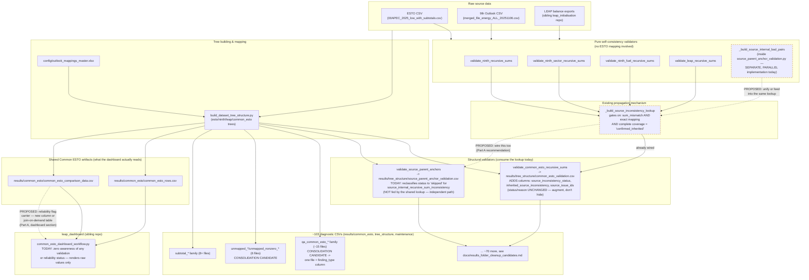

# Design: propagating a data-reliability flag through diagnostics, and consolidating the diagnostic-file sprawl

**Status: design only. No code changed as part of this document.** Written 2026-07-23, in
`leap_mappings/.claude/worktrees/anchor-validator-fixes-ee04bc`. Read this in full before
implementing anything it recommends — several of its conclusions only make sense in light of a
precedent this repo already has (see "The most important finding" below), and skipping to a
recommendation without that context risks re-deriving something already built, or missing why one
design choice here beats another that looks superficially similar.

## Why this document exists

Two originally-separate asks got merged into one design task on 2026-07-23, at the user's
request, because they turned out to be the same underlying question — how diagnostic signal is
organized, stored, and surfaced across this pipeline:

- **Part A**: `codebase/mapping_tools/source_parent_anchor_validation.py` has ~603 rows failing
  validation (across `09_06_gas_processing_plants`, `15_solid_biomass`/`16_others`/`08_gas`,
  `14_industry_sector` NINTH families) because NINTH's own raw source data disagrees with itself
  — a parent sector/fuel total doesn't match the sum of its own more granular children. Multiple
  sessions tried direct fixes (extending the existing narrow check to a row's own pair; a
  "deep-descendant-evidence" signal); both were real-data-verified to fail — see
  `docs/archive/anchor_validation_methodology/anchor_validator_fixes_findings_20260723.md`,
  items 1/3/4. The user explicitly
  rejected "trust the more granular data and substitute it as the corrected value" — sometimes
  the parent/aggregate is the accurate value and the breakdown is wrong, and there's no reliable
  way to tell which from the data alone. Reframed: **flag the inconsistency, don't guess a fix,
  and make the flag propagate** through every downstream diagnostic and the `leap_dashboard`
  rendering, so nothing re-discovers or misses the same root problem independently.
- **Part B**: this repo currently writes **103 distinct diagnostic/QA CSV files** (verified count
  as of 2026-07-23 across `results/common_esto/`, `results/tree_structure/`, and
  `results/maintenance/` — this will drift, re-count before trusting it later) and the user wants
  to explore consolidating groups of them into fewer files with shared structure.

The synthesis point: a consolidated diagnostic file is a natural place for a reliability flag
column to live, rather than bolting it onto N separate existing files independently.

## The most important finding: half of this already exists, and it's a better design than what the anchor validator has

Before designing anything new, I read `codebase/mapping_tools/build_dataset_tree_structure.py`
and `codebase/mapping_tools/common_esto_validation_orchestration.py` end to end. **This repo
already has a working, real propagation mechanism between two of its three validator families —
it's just never been extended to the third (the anchor validator) or to the dashboard.**

### How it works today

`run_mapping_pipeline.py`'s Stage 3 path calls, in order:

1. `validate_ninth_recursive_sums`, `validate_ninth_sector_recursive_sums`,
   `validate_ninth_fuel_recursive_sums`, `validate_leap_recursive_sums` — four **pure
   self-consistency checks**, each on one source system's own raw file, no ESTO mapping or Common
   ESTO structure involved (conceptually identical in spirit to the anchor validator's own
   `_build_source_internal_bad_pairs`, but implemented completely independently, on the raw
   source hierarchy directly rather than via the mapped-frontier machinery).
2. `_build_source_inconsistency_lookup` (`build_dataset_tree_structure.py:1656`) takes all four
   of those validators' findings and builds an exact-context lookup keyed by `(source_system,
   economy, scenario, year, axis, parent_code, other_axis_value)`, with a `status` field that is
   `"confirmed_inherited"` only when a specific, narrow gate passes (see below) — otherwise it
   carries the raw issue class (`"children_incomplete"`, `"mapping_ambiguous"`, `"sum_mismatch"`
   without full eligibility, etc.).
3. That lookup is threaded into `validate_common_esto_recursive_sums`
   (`common_esto_validation_orchestration.py:671` → `_validate_common_esto_axis_recursive_sums`),
   which is the **separate** validator producing `results/tree_structure/common_esto_validation.csv`
   (the "Internal Common ESTO parent/child consistency" section you see in the pipeline log). For
   every mismatch it finds, it looks up the matching key and — critically — **does not silently
   drop or reclassify the row**. It adds five new columns instead:
   - `source_inconsistency_status` (e.g. `"confirmed_inherited"`, `"not_attributed"`, `"multiple_source_issue_classes"`)
   - `sector_hierarchy_status`, `fuel_hierarchy_status` (which specific hierarchy check matched, if any)
   - `source_issue_ids` (joined IDs back to the originating source-level finding, for traceability)
   - `inherited_source_inconsistency` (boolean — the simple "is this explained by a known upstream issue" flag)

   `status`/`reason` on the row **stay exactly what they'd have been anyway** (`"failed"` if it
   doesn't reconcile, `"passed"` if it does) — the inherited-issue information is purely additive.

### The gate that decides "confirmed_inherited" vs. not

This is the part that matters most for Part A. `inheritance_eligible`
(`build_dataset_tree_structure.py:1108`) is true **only when all three of**:
- `source_issue_class == "sum_mismatch"` — children are present and mapped, but their sum
  genuinely doesn't match the parent (as opposed to `"children_incomplete"`: no nonzero children
  found at all, or `"mapping_ambiguous"`: a child maps to more than one target).
- `mapping_status == "exact"` — the source-to-ESTO mapping itself isn't ambiguous, missing, or
  flow-mismatched for this pair.
- `child_coverage_status == "complete"` — every nonzero child was actually found and mapped.

In other words: the only inconsistencies allowed to propagate downstream as "safe to attribute,
not a fresh problem" are ones where the *mapping and coverage are unambiguously fine* and the
*only* remaining explanation is the source data disagreeing with itself. This is exactly the
distinction the anchor validator's reverted attempts kept failing to draw reliably — and this
existing mechanism draws it in a narrower, more defensible way (three independent necessary
conditions, not a single heuristic signal) than either of the anchor-validator attempts did.

### What this means for Part A

**Recommendation: don't design a new flag mechanism for the anchor validator from scratch.**
Instead:

1. Extend `_build_source_inconsistency_lookup`'s four input validators (or add a fifth,
   equivalent one) to also cover the specific family shapes the anchor validator's mirror-row gap
   surfaces (`09_06_gas_processing_plants`, `15_solid_biomass`/`16_others`/`08_gas`,
   `14_industry_sector`) — these are NINTH-side, and `validate_ninth_sector_recursive_sums`/
   `validate_ninth_fuel_recursive_sums` may already substantively cover some of them (worth
   checking directly against the specific failing rows before assuming a new validator is
   needed — a likely first step is running the existing four validators against exactly the rows
   the anchor validator flags and checking for overlap, rather than assuming zero coverage).
2. Thread the resulting lookup into `validate_source_parent_anchors`
   (`source_parent_anchor_validation.py`) the same way it's already threaded into
   `validate_common_esto_recursive_sums` — as an optional parameter, looked up by the same key
   shape, adding the same five-column pattern (`source_inconsistency_status`,
   `inherited_source_inconsistency`, etc.) to the anchor validator's own output rows.
3. **Change the anchor validator's current behavior to match the Common ESTO validator's
   philosophy**: `1c17af8`'s `source_internal_recursive_sum_inconsistency` reclassifies `status`
   to `"skipped"` outright. Recommend switching to the augment-don't-hide pattern instead — keep
   `status`/`reason` as `"failed"`/whatever it would otherwise be, and add the inherited-issue
   columns alongside. This is a meaningful behavior change from what's shipped today (`1c17af8`
   through the current `c6772a9` state), so it needs explicit sign-off — the tradeoff: the
   augmented approach never hides a row from anyone counting failures, which is safer, but means
   existing consumers that currently read "skipped, therefore explained" for this specific reason
   string will need to instead check the new boolean column. Check every current reader of
   `source_parent_anchor_validation.csv`'s `status`/`reason` columns for this dependency before
   switching (a grep across `codebase/` and any downstream dashboard/report code) — this is
   exactly the kind of consumer-breakage risk flagged generically in the open-questions section
   below, made concrete here.

This is a smaller, safer piece of work than building something new, and it reuses a
three-year-old(-feeling), already-tested gating heuristic instead of inventing a fourth one.

## Part A continued: reaching the dashboard

Confirmed directly (`grep` across `leap_dashboard/codebase/common_esto_dashboard_workflow.py` for
`source_inconsistency`, `inherited_source`, `reliability`, etc.): **zero hits.** The dashboard has
no awareness of any validation status today — it renders `results/common_esto/common_esto_rows.csv`
and `common_esto_comparison_data.csv` directly, with no join against `common_esto_validation.csv`
or `source_parent_anchor_validation.csv` at all.

To actually reach the dashboard, the propagated flag needs a carrier into one of the two files the
dashboard reads. Two options, not mutually exclusive:

- **Add a reliability column to `common_esto_comparison_data.csv` itself** (or a sibling file
  joined on the same `common_row_id`/economy/scenario/year key the dashboard already uses) — the
  most direct path, since the dashboard already loads this file. Requires Stage 3 to compute and
  attach the flag per comparison row, which means resolving it down from the `(source_system,
  economy, scenario, year, axis, parent_code, other_axis_value)` granularity the validators use
  today to the `common_row_id` granularity the comparison data uses — these are not the same key
  space (a `common_row_id` can aggregate several `(parent_code, other_axis_value)` pairs), so this
  needs its own small design pass, not assumed to be a trivial join.
- **A separate, join-on-demand reliability table** (e.g. `results/common_esto/data_reliability_flags.csv`,
  keyed the same way `common_esto_validation.csv`/`source_parent_anchor_validation.csv` already
  are) that the dashboard optionally loads and joins at render time. Lower risk to existing
  pipeline outputs (doesn't touch the comparison data schema), but requires the dashboard to
  actually do the join, which is new dashboard-side work in a different repo.

Recommend the second option as the safer first step (no schema change to a file other tooling may
already depend on), with the first considered later once the dashboard side proves the concept.

## Part B: diagnostic-file consolidation

### Current state (counted 2026-07-23, re-count before trusting later)

103 distinct CSVs across `results/common_esto/` (majority), `results/tree_structure/`, and
`results/maintenance/`. Grouped by clear naming-family (verify each grouping against actual column
schemas before merging anything — name-prefix clustering is a starting heuristic, not proof of
compatible structure):

| Family | Approx. count | Shape |
|---|---|---|
| `qa_common_esto_*` | 15+ (`_unresolved_partial_coverage`, `_structural_partial_coverage`, `_partial_coverage_components_without_relevance`, `_existing_components_without_relevance`, `_partial_coverage_mapping_candidates`[`_rebuilt`], `_duplicate_components`, `_excluded_components`, `_non_expanding_rollups`, `_non_expanding_frontier_check`, `_rollup_explanations`, `_source_aggregates_split`, `_structure_summary`, `_suppressed_graph_edges`, `_total_check`, `_axis_partition_skipped_broad_rows`, `_flow_axis_partitions`, `_product_axis_partitions`, `_flow_intersections_resolved`, `_product_intersections_resolved`, `_components_missing_from_structure`) | Most are Stage 2 structural-coverage diagnostics sharing an implicit "component pair + reason it's flagged" shape — strong consolidation candidate. |
| `unmapped_*`/`unmapped_nonzero_*` | 6 (`unmapped_esto_pairs`, `unmapped_ninth_pairs`, `unmapped_nonzero_esto_pairs`[`_allowed_matched`], `unmapped_nonzero_ninth_pairs`[`_allowed_matched`]) | Same shape repeated per source system (ESTO/NINTH) and per zero/nonzero filter — a `source_system` + `is_nonzero_filtered` discriminator column could plausibly collapse these into one file. |
| `subtotal_*` | 8+ (`subtotal_draft_esto_pairs`, `_ninth_pairs`, `_leap_pairs`, `subtotal_mismatches`[`_allowed_matched`, `_including_exceptions`], `subtotal_mismatch_suggested_improvements`, `subtotal_label_overrides_stale`) | Same "draft pairs per source system" pattern as above; the `_allowed_matched`/`_including_exceptions` suffix pattern recurs across families (see below) and is itself a candidate for a shared mechanism. |
| `source_parent_anchor_*` | 5 (`_validation`, `_validation_summary`, `_validation_SLICE`, `_validation_SLICE_summary`, `_MISSING_children`, `_MISSING_parent_pairs`) | The `_SLICE`/`_MISSING_*` variants are flagged as likely-orphaned in `docs/results_folder_cleanup_candidates.md` (zero current code references) — check that resolution first; if confirmed dead, this family shrinks to just the 2 live files before any consolidation design is needed. |
| `*_allowed_matched.csv` companion pattern | Recurs across `unmapped_nonzero_*`, `subtotal_mismatches`, `many_to_many_conflicts`, `leap_source_presence_conflicts`, `crosswalk_target_conflicts` (5+ base files, each with a companion) | This is the clearest, most mechanical consolidation target: every one of these pairs is "the full findings list" + "the subset matched by a reviewed exception in `config/mapping_issue_exception_sets.xlsx`". A single shared helper already partially exists for this shape — `codebase/mapping_issue_exceptions.py`'s `split_allowed_rows` (splits a candidate frame into `needs_review`/`allowed` using an exception sheet). Recommend checking whether every one of these 5+ pairs already calls `split_allowed_rows` (if so, they could plausibly emit ONE column — `exception_status` — instead of two files, unifying naturally with Part A's "augment, don't split" philosophy) or still has a bespoke, duplicated split implementation (if so, that's a real duplication worth fixing independent of the file-count question). |
| `common_esto_validation_*` | 8 (`_validation`, `_by_year`, `_child_detail`, `_issue_patterns`, `_rollup_diagnosis`, `_summary`, `_totals`, plus two dated `_baseline_20260708` snapshots) | The `_baseline_20260708` pair look like one-off manual snapshots, not regular pipeline output — candidates for archiving (see `docs/results_folder_cleanup_candidates.md`) rather than consolidating with the live 6. |

### Recommended consolidation approach

Follow the precedent Part A already established: **prefer adding a discriminator column over
maintaining N near-identical files.** Concretely, for the `qa_common_esto_*` family (the largest,
clearest candidate): a single `qa_common_esto_findings.csv` with a `finding_type` column (one
value per current filename) and a shared core schema (component pair, comparison scope, economy/
scenario/year where applicable, the specific reason/status text) would replace ~15 files with one,
IF their actual columns are compatible enough — this needs verifying against real current output
before committing to a merged schema, not assumed from names alone.

**This is explicitly a design recommendation, not a completed design.** The actual merged schema
for each family, and the code changes to each producing function (`build_common_esto_structure.py`,
`apply_common_esto_structure.py`, and others — grep each filename above for its writer before
touching anything), is real, nontrivial follow-up work. Do not attempt the consolidation itself
without a closer per-family pass confirming column compatibility.

### Where the Part A flag naturally fits

If the `qa_common_esto_*` consolidation happens, `inherited_source_inconsistency`-style columns
belong there naturally — one more discriminator/status column on an already-consolidated
findings file, rather than a bespoke addition to whichever of the 103 files happens to be the one
a mismatch shows up in today. This is the concrete version of the synthesis point from the top of
this document.

## Mermaid diagram

## Open questions / risks (stated explicitly, not silently decided)

1. **Flag staleness.** If a flagged pair's underlying source data is later corrected (e.g. NINTH
   ships a data fix), does the flag need to be re-derived every pipeline run (yes, by construction
   — the lookup is rebuilt fresh each run from current validator output, so this isn't actually a
   real risk for the *existing* mechanism; confirm the same holds if Part A extends it to the
   anchor validator, i.e. don't accidentally introduce caching that could go stale).
2. **Over-broad suppression risk.** This is the central risk the anchor validator's reverted
   attempts kept hitting. The existing `inheritance_eligible` gate (sum_mismatch AND exact mapping
   AND complete coverage) is narrower and more defensible than either prior anchor-validator
   attempt, but it has not been tested against the anchor validator's specific failing families —
   **do not assume it transfers cleanly without re-running the same real-data A/B discipline this
   repo has used throughout** (verify zero of the currently-760 failing rows get wrongly
   reclassified, the same check `1c17af8` and the reverted attempts were held to).
3. **Consumer breakage from the status-vs-augment change.** If Part A's recommendation to switch
   the anchor validator from "reclassify to skipped" to "augment with columns" is taken, anything
   currently reading `source_internal_recursive_sum_inconsistency` as a `reason` string will break
   silently unless updated. Grep for this string across `codebase/` and any spreadsheet/report
   tooling before changing it.
4. **Diagnostic-file consolidation could break existing readers.** Some of the 103 files may be
   read by name from other scripts, docs, or manual analyst workflows not visible from a code grep
   alone (e.g. `docs/improvement_todo.md` names several by exact filename as "primary review
   outputs"). Before merging any family, grep the whole repo (including docs) for the exact
   filename, not just `codebase/*.py`.
5. **Three-state dashboard rendering.** If the flag reaches the dashboard, it should distinguish
   three states, not two: "genuinely reconciles" (pass), "genuinely fails" (real problem, act on
   it), and "flagged as unreliable, don't trust this comparison either way" (the new state) — a
   two-state pass/fail rendering would either wrongly show flagged pairs as clean or wrongly show
   them as broken, both misleading. This needs actual UI/rendering design in the `leap_dashboard`
   repo, out of scope for this document but flagged so it isn't forgotten.

## What this document does NOT do

No code was written or modified. No file was consolidated. No validator was changed. The two
concrete next steps this document points to — (a) checking whether the existing four
self-consistency validators already substantively cover the anchor validator's mirror-row-gap
families, and (b) a per-family column-compatibility check before any diagnostic-file merge — are
both investigative, not implementation, and are the natural follow-up tasks once this design is
reviewed.
