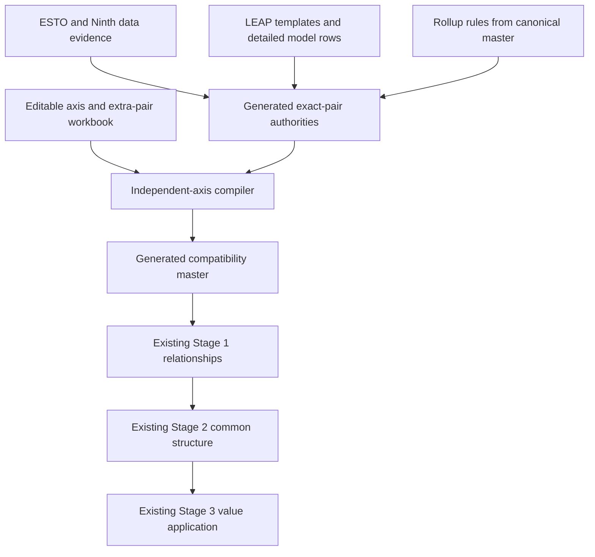

# Separate-axis mapping generation

**Status:** merged to local `master` and promoted to the production mapping
refresh on 2026-07-30 after end-to-end shadow validation.

**Production boundary:** people edit the single-axis workbook. The refresh
generates exact-pair authority and, after reopen validation, promotes the
compatibility view to `config/outlook_mappings_master.xlsx`. Existing consumers
continue to read that stable filename.

## Why this is the new first mapping step

The old contract asks people to maintain complete sector/fuel-to-flow/product
pair rows. That repeats the same sector and fuel meanings many times and makes
it difficult to distinguish semantic mappings from combinations that merely
exist in a dataset.

The separate-axis process moves the human-maintained semantics upstream:

1. maintain sector/flow relations independently from fuel/product relations;
2. generate the exact source and target pair authorities from dataset
   structure and temporal evidence;
3. combine the axes only for accepted source and target pairs; and
4. emit the same three pair sheets expected by the existing mapping pipeline.

The generated compatibility workbook therefore becomes the input boundary for
Stages 1–3. Downstream code does not need to understand the separate-axis
representation. There is no active general Stage 0.

## Workbook responsibilities

### Human-edited contract

`config/outlook_mappings_single_axis.xlsx`

This is the only new workbook people edit. It contains:

- six axis sheets:
  - `leap_sector_to_esto`;
  - `leap_fuel_to_esto`;
  - `leap_sector_to_ninth`;
  - `leap_fuel_to_ninth`;
  - `ninth_sector_to_esto`; and
  - `ninth_fuel_to_esto`;
- four accepted-extra-pair sheets:
  - `extra_leap_key_pairs`;
  - `extra_esto_key_pairs`;
  - `extra_esto_extended_pairs`; and
  - `extra_ninth_key_pairs`.

Every populated row is accepted. Add a row to accept a relation or exact pair;
delete it to withdraw that acceptance. There are no enabled flags or Boolean
checkbox controls.

The compiler requires all six axis sheets. If none exist, it can derive them
once from the old pair master as a bootstrap. If only some exist, compilation
stops rather than silently mixing authorities.

### Generated pair evidence

`config/outlook_mappings_key_pairs_generated.xlsx`

This workbook is generated and must not be edited. It records all considered
flow/product or sector/fuel combinations and distinguishes:

- structural presence in the source dataset;
- non-zero evidence at the ESTO historical boundary;
- non-zero evidence after that boundary in Ninth projections;
- rollup-derived pairs; and
- reviewed extra pairs.

The narrow `pair_origin` field records the provenance. Reviewed extra rows use
`reviewed_extra`. Boolean fields are shown as literal `TRUE` or `FALSE`, not as
checkboxes.

### Generated compatibility master

`config/outlook_mappings_master.xlsx`

This production compatibility workbook is also generated and must not be
edited directly. It preserves all 14 sheet names and exact mapping-sheet
headers. The 11 non-pair sheets are preserved; only the bodies of these three
sheets are compiled:

- `leap_combined_esto`;
- `leap_combined_ninth`; and
- `ninth_pairs_to_esto_pairs`.

That stable interface means current consumers read the generated workbook with
their existing loaders. The prior workbook hash and a backup copy are recorded
in the generation evidence; Git restore plus regeneration is the rollback.

## Authority and temporal rules

An exact pair can be used by the compiler when either the generated evidence or
the editable exception layer accepts it.

- Ordinary ESTO historical evidence means non-zero in the final ESTO year,
  currently 2023.
- ESTO Extended uses structural pair presence rather than current non-zero
  evidence. Detailed model categories are allowed to be zero in the present
  data and remain eligible for compilation; reviewed extras can also admit a
  pair absent from the generated structure.
- Ninth future evidence means non-zero in at least one year after the ESTO
  boundary.
- LEAP structural authority is generated from current economy export templates
  plus the detailed demand/power row inventory. A source manifest triggers
  regeneration when any contributing template changes.
- Active rollup rules add only exact pairs derivable from contributing pairs;
  they do not create an unrestricted Cartesian product.
- A row on an accepted-extra-pair sheet is sufficient authority even when the
  available dataset is structurally absent or zero-only.

The extra-pair layer is deliberately permissive. It preserves reviewed or
plausible relationships while the axis model is introduced, and can be reduced
later by deleting rows after semantic review.

Every production refresh also checks all ten editable sheets for repeated
mapping keys. Comparison trims surrounding whitespace and treats
`esto_dataset_scope` case-insensitively. The first occurrence is retained and
later exact duplicates are removed from the editable workbook itself.
Relationships with different targets are not duplicates and remain available
for legitimate one-to-many or many-to-one mapping. The refresh writes a
per-sheet audit to
`outputs/separate_axis_mapping_refresh/workbooks/editable_duplicate_cleanup.json`
and records the same summary in the generation manifest.

Before pair compilation, the compiler analyses connected components on each
axis. It stops promotion when a component contains more than 12 source-plus-
target nodes or when a product component spans more than one numbered target
fuel family. These are strong signatures of a shifted spreadsheet range or an
accidental context-specific relation becoming global. Small many-to-many
hierarchy bridges remain explicit review items.

## Compilation sequence

The compiler works by mapping each accepted source pair along its sector axis
and fuel axis, taking the resulting target combinations, then retaining only
target pairs accepted by the relevant target authority. The current migration
policy provisionally accepts additional Cartesian relationships so they can be
reviewed without blocking integration. They are recorded as
`provisionally_accepted`, not as pending exclusions.

## Current measured contract

The 2026-07-29 refresh reads the editable workbook directly and reports:

| Measure | Rows |
|---|---:|
| editable sector/flow relations | 327 |
| editable fuel/product relations | 258 |
| maintained pair relationships reproduced | 7,649 of 7,649 |
| additional provisionally accepted relationships | 3,501 |
| generated compatibility relationships | 11,150 |
| within-axis many-to-many components retained for review | 8 |

The 3,501 additions consist of 1,772 extra targets for already mapped source
pairs and 1,729 newly eligible source-pair candidates. They remain included so
the pipeline can be tested end to end; later review can narrow the axes or add
explicit exclusions.

## Stage 1-2 shadow result

The first isolated canonical/generated comparison completed on 2026-07-29.
Both variants used the same code, comparison scopes, rollup sheets, and
configuration; only the selected mapping workbook changed.

| Gate | Canonical | Generated | Interpretation |
|---|---:|---:|---|
| pair-sheet schema | 3 current schemas | exact match | passed |
| Stage 1 total rows | 17,076 | 22,300 | generated master removes old incomplete/removed diagnostics and adds accepted rows |
| Stage 1 complete retained rows | 15,298 | 22,300 | all 15,298 current functional use-case rows remain; 7,002 rows = 3,501 additions across two use cases |
| Stage 2 Common ESTO map rows | 10,044 | 10,562 | net +518, but membership changes are much broader |
| Stage 2 map rows unchanged | 6,032 | 6,032 | shared exact component-to-common-row memberships |
| Stage 2 canonical-only memberships | 4,012 | — | components whose partition changed |
| Stage 2 generated-only memberships | — | 4,530 | replacement/new memberships |
| shared relationship subtotal flag differences | — | 184 | all are source flags changing `FALSE` to `TRUE`; target flags are unchanged |

The subtotal differences are concentrated in 183 Ninth-to-ESTO relationships
and one LEAP-to-Ninth relationship. They are consistent with the generated
registry recognizing aggregate source pairs that the old workbook labelled as
non-subtotals; they still require review because subtotal metadata affects graph
construction.

The initial generated graph exposed a source-once defect because direct target
pairs labelled as subtotals were excluded from aggregate edges. The
separate-axis path uses a manifest-bound rule that:

- allows direct reviewed subtotal targets to form source aggregate edges;
- continues to suppress every `is_rollup_derived=TRUE` target;
- keeps a protected subtotal flow separate from its declared child flows; and
- permits product aggregation within that same protected subtotal flow.

The rule is enabled only when the generation-manifest hash matches the active
canonical workbook. A manually restored or overridden workbook cannot silently
inherit the generated-contract behavior.

The refined generated Stage 2 result is:

- 10,562 exact component-to-Common-row map memberships;
- 1,019 `esto_leap`, 1,020 `esto_extended_leap`, and 1,035 rows in each
  three-source scope;
- zero missing or duplicate components;
- zero unresolved partial-coverage rows in LEAP-only scopes and 14 in each
  three-source scope;
- zero source-aggregate splits in LEAP-only scopes and 27 in each three-source
  scope, all protected parent/detail alternatives; and
- all 30 non-expanding subtotals pass the rule that no parent shares a Common
  row with its declared children.

This proves interface compatibility, but not semantic equivalence. The
3,501-row provisional policy changes Common ESTO partitioning far beyond 518
net rows. Promotion therefore requires either accepting that new structure
explicitly or narrowing the provisional axes/relationships before the
canonical filename changes.

### Stage 3 source-once gate

A bounded structural Stage 3 precheck joins each included conversion source
pair to the Common ESTO rows reached by all of its generated target components.
A source pair reaching more than one unrelated common row would deliver its
value more than once unless an allocation rule exists. A declared
non-expanding parent row and its detail frontier are alternative,
non-additive views and are classified separately.

| Source-once measure | Canonical | Generated |
|---|---:|---:|
| source-pair/scope groups reaching multiple common rows | 177 | 54 |
| protected parent/detail alternatives | 74 | 54 |
| unexplained unsafe groups | 103 | 0 |
| maximum common rows reached by one source pair | 8 | 2 |

The structural source-once gate therefore passes for the generated path. The
54 two-row groups are the 27 Ninth agriculture/fishing parent/detail
alternatives in each three-source scope; all match Stage 2's explicit
non-expanding split QA.

The original full value attempt exposed a separate performance problem:
single-pass Ninth conversion materialised more than 10 GB while building
lineage. Conversion now runs and writes atomically one economy at a time. A
two-economy regression test proves chunked converted values and lineage are
identical to the former single-pass result.

Stage 3 now also applies the Common structure in source-system/economy
batches, streams component lineage to an atomic gzip file, and dictionary
encodes repeated source labels during the relevance pass. Batching is now the
production Stage 3 default.

The final full-data shadow gate completed on 2026-07-29 after merging the
current `master` implementation. It used the `generated_merged_final` Stage 2
variant and explicit shadow-cache source paths, leaving the registry-backed
production defaults unchanged:

| Stage 3 measure | Result |
|---|---:|
| source rows read after configured exclusions | 18,657,595 |
| non-zero relevant source rows applied | 2,579,778 |
| Common comparison fact rows | 1,658,315 |
| Common metadata rows | 2,365 |
| component-lineage gzip size | 259,058,883 bytes |
| mapped scope/source combinations checked | 10 |
| maximum absolute mapped-row total difference | `1.1641532182693481e-10` |
| mapped value coverage | 100% in all 10 combinations |
| Stage 3 elapsed time | 1,839.189 seconds |
| published output-status records | 10 passed, 0 failed |

The additive fact/metadata contract was published atomically and its hashes
were verified. The generated path produced zero unsafe structural fan-outs,
and every mapped source value is delivered exactly once within each selected
comparison scope.

Stage 3 also reported 520,964 source rows without an exact Common component
map. Of these, 520,366 are ESTO/ESTO Extended rows; the largest groups are
parent, subtotal, and combined transformation/demand flows, but the file also
contains other out-of-contract pairs that remain reviewable. The other 598
rows are one ESTO-Extended-only Ninth pair correctly absent from the base-ESTO
scope. This is a coverage diagnostic, not a source-once failure. These rows are
outside the mapped-universe preservation test and remain visible for review.

The remaining review diagnostics are semantic rather than value-delivery
failures:

- 29 broad Common rows, with at most 126 exact components;
- 14 partial-coverage rows in each three-source scope;
- 178 non-zero LEAP branches without direct ESTO mappings;
- eight within-axis many-to-many components; and
- 3,501 provisionally accepted Cartesian relationships.

The shadow run used `skip_deep_validation=True` after the structure,
source-once, lineage, contract, and value-preservation gates. The recursive
source-tree and parent-anchor suite is unchanged canonical validation and was
not repeated during this RAM-constrained feature gate.

The 2026-07-30 promotion decision is:

- the separate-axis compiler, workbooks, and review QA are the production first
  mapping step;
- the chunked Stage 3 value totals, lineage, and output contract pass;
- the 3,501 provisional relationships can remain enabled for continued
  end-to-end work, while the eight within-axis many-to-many components and
  broad Common rows remain explicit semantic review debt.

### 2026-07-30 corrective regeneration

A later full run found that the old `Buildings` subtotal block had a one-row
shift between LEAP fuels and ESTO products. Thirty-six invalid relations had
entered the global fuel axis and produced a 37-product connected component.
The repair removed those 36 relations, retained the final correctly aligned
Bagasse row, and regenerated 37 correctly aligned Buildings subtotal pairs.

The same review restored 56 ESTO Extended flow relations and 33 product
relations from the prior detailed mapping set. ESTO Extended compilation now
uses structural pair authority, so currently zero-only detailed categories are
not discarded. The generated compatibility master contains 331
`ESTO_EXTENDED` LEAP-to-ESTO rows and no shifted Buildings relation.

The full default pipeline then completed across five LEAP economies:

| Measure | Corrective run |
|---|---:|
| ESTO-shaped source rows read | 18,822,031 |
| non-zero source rows applied | 2,645,140 |
| Common comparison rows | 3,963,164 |
| Common metadata rows | 11,536 |
| maximum absolute mapped-row total difference | `1.1641532182693481e-10` |
| mapped value coverage | 100% in all mapped scope/source combinations |
| Ninth sector hierarchy findings | 0 |
| Ninth fuel hierarchy findings | 0 |
| actionable partial-coverage rows | 28 |
| non-zero LEAP branches without direct ESTO mappings | 398 |

The dashboard diagnostic context builder also expands grouped source-axis
labels such as `fuel A + fuel B` before looking up exact mappings. The repaired
20USA render contains neither the former 37-product title nor the blank mapped
detail message.

## Running the refresh from Jupyter

The production entrypoint is:

`codebase/separate_axis_mapping_refresh_workflow.py`

It uses `#%%` cells and repository-relative paths. Its bottom cell compiles the
contract, prepares workbook source tables, invokes the artifact builder,
reopens and validates the outputs, and promotes the canonical compatibility
workbook.

The artifact builder is
`codebase/separate_axis_mapping_workbooks_artifact_builder.mjs`. It must use
the bundled `@oai/artifact-tool` runtime. Build the editable workbook only for
an intentional bootstrap or format migration; ordinary refreshes rebuild the
generated pair workbook and compatibility master while leaving the user-edited
workbook untouched.

The ordinary mapping run is:

1. refresh pair authority and compile the compatibility master;
2. review generation QA and run a focused hierarchy/source-row review only
   when its evidence changed;
3. run Stages 1–3.

## Required gates on every promoted refresh

The generated master must satisfy all of these:

- exact pair-sheet schemas match the canonical workbook;
- the editable duplicate audit reports zero remaining duplicate mapping keys;
- no oversized or cross-family axis component reaches compilation;
- every maintained relationship is reproduced or deliberately retired;
- shared relationship subtotal flags do not change unexpectedly;
- Stage 1 relationship differences are explained by the provisional additions;
- Stage 2 Common ESTO membership differences are understood;
- Stage 3 proves source values are applied once and value totals reconcile;
- no consumer needs a schema or loader change; and
- the canonical workbook can be restored directly as the rollback.

The eight within-axis many-to-many components and the 3,501 provisional
relationships are review debt, not hidden failures. They must remain explicit
in QA and work-queue records until resolved.

## Files and ownership

| File | Owner | Edit policy |
|---|---|---|
| `config/outlook_mappings_single_axis.xlsx` | mapping reviewers | edit |
| `config/outlook_mappings_key_pairs_generated.xlsx` | compiler | do not edit |
| `config/outlook_mappings_master.xlsx` | compiler / stable consumer interface | do not edit directly |
| `config/outlook_mappings_generation_manifest.json` | compiler | do not edit |
| `outputs/separate_axis_mapping_refresh/` | compiler QA, candidate, and rollback evidence | generated |
| `outputs/separate_axis_mapping_shadow_validation_20260729/` | integration QA | generated |

The deferred move of `data/temp/new leap rows.xlsx` to
`leap_initialisation/data/leap_export_templates/detailed leap model rows.xlsx`
is tracked as MAPQ-035 in `docs/work_queue.md`.
