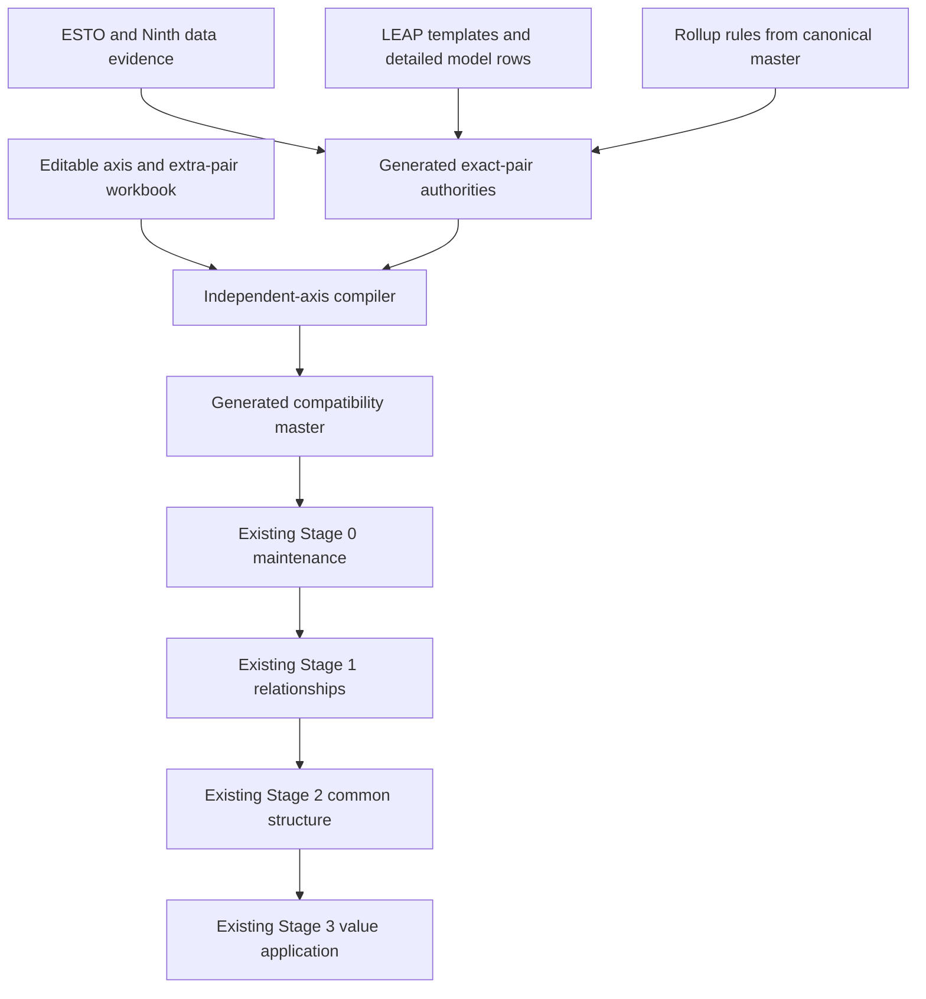

# Separate-axis mapping generation

**Status:** implemented as a review-only shadow pipeline on
`codex/separate-axis-mapping-exploration`.

**Promotion boundary:** the generated compatibility master is not yet
`config/outlook_mappings_master.xlsx`. Promotion requires review of the shadow
validation results and an explicit decision to replace that file.

## Why this is the new first mapping step

The old contract asks people to maintain complete sector/fuel-to-flow/product
pair rows. That repeats the same sector and fuel meanings many times and makes
it difficult to distinguish semantic mappings from combinations that merely
exist in a dataset.

The separate-axis process moves the human-maintained semantics upstream:

1. maintain sector/flow relations independently from fuel/product relations;
2. generate the exact source and target pair authorities from dataset
   structure and temporal evidence;
3. combine the axes only for accepted source and target pairs; and
4. emit the same three pair sheets expected by the existing mapping pipeline.

The generated compatibility workbook therefore becomes the input boundary for
the existing Stage 0 and Stages 1–3. Downstream code does not need to understand
the separate-axis representation.

## Workbook responsibilities

### Human-edited contract

`config/outlook_mappings_single_axis_prototype.xlsx`

This is the only new workbook people edit. It contains:

- six axis sheets:
  - `leap_sector_to_esto`;
  - `leap_fuel_to_esto`;
  - `leap_sector_to_ninth`;
  - `leap_fuel_to_ninth`;
  - `ninth_sector_to_esto`; and
  - `ninth_fuel_to_esto`;
- four accepted-extra-pair sheets:
  - `extra_leap_key_pairs`;
  - `extra_esto_key_pairs`;
  - `extra_esto_extended_pairs`; and
  - `extra_ninth_key_pairs`.

Every populated row is accepted. Add a row to accept a relation or exact pair;
delete it to withdraw that acceptance. There are no enabled flags or Boolean
checkbox controls.

The compiler requires all six axis sheets. If none exist, it can derive them
once from the old pair master as a bootstrap. If only some exist, compilation
stops rather than silently mixing authorities.

### Generated pair evidence

`config/outlook_mappings_key_pairs_generated_prototype.xlsx`

This workbook is generated and must not be edited. It records all considered
flow/product or sector/fuel combinations and distinguishes:

- structural presence in the source dataset;
- non-zero evidence at the ESTO historical boundary;
- non-zero evidence after that boundary in Ninth projections;
- rollup-derived pairs; and
- reviewed extra pairs.

The narrow `pair_origin` field records the provenance. Reviewed extra rows use
`reviewed_extra`. Boolean fields are shown as literal `TRUE` or `FALSE`, not as
checkboxes.

### Generated compatibility master

`config/outlook_mappings_master_generated_prototype.xlsx`

This workbook is also generated and must not be edited. It preserves all 14
sheet names and the exact mapping-sheet headers used by
`config/outlook_mappings_master.xlsx`. The 11 non-pair sheets come from the
canonical workbook; only the bodies of these three sheets are compiled:

- `leap_combined_esto`;
- `leap_combined_ninth`; and
- `ninth_pairs_to_esto_pairs`.

That stable interface is the rollback and migration mechanism: current
consumers can read the generated workbook with their existing loaders.

## Authority and temporal rules

An exact pair can be used by the compiler when either the generated evidence or
the editable exception layer accepts it.

- ESTO and ESTO Extended historical evidence means non-zero in the final ESTO
  year, currently 2023.
- Ninth future evidence means non-zero in at least one year after the ESTO
  boundary.
- LEAP structural authority is generated from current economy export templates
  plus the detailed demand/power row inventory. A source manifest triggers
  regeneration when any contributing template changes.
- Active rollup rules add only exact pairs derivable from contributing pairs;
  they do not create an unrestricted Cartesian product.
- A row on an accepted-extra-pair sheet is sufficient authority even when the
  available dataset is structurally absent or zero-only.

The extra-pair layer is deliberately permissive. It preserves reviewed or
plausible relationships while the axis model is introduced, and can be reduced
later by deleting rows after semantic review.

## Compilation sequence

The compiler works by mapping each accepted source pair along its sector axis
and fuel axis, taking the resulting target combinations, then retaining only
target pairs accepted by the relevant target authority. The current migration
policy provisionally accepts additional Cartesian relationships so they can be
reviewed without blocking integration. They are recorded as
`provisionally_accepted`, not as pending exclusions.

## Current measured contract

The 2026-07-29 refresh reads the editable workbook directly and reports:

| Measure | Rows |
|---|---:|
| editable sector/flow relations | 327 |
| editable fuel/product relations | 258 |
| maintained pair relationships reproduced | 7,649 of 7,649 |
| additional provisionally accepted relationships | 3,501 |
| generated compatibility relationships | 11,150 |
| within-axis many-to-many components retained for review | 8 |

The 3,501 additions consist of 1,772 extra targets for already mapped source
pairs and 1,729 newly eligible source-pair candidates. They remain included so
the pipeline can be tested end to end; later review can narrow the axes or add
explicit exclusions.

## Stage 1-2 shadow result

The first isolated canonical/generated comparison completed on 2026-07-29.
Both variants used the same code, comparison scopes, rollup sheets, and
configuration; only the selected mapping workbook changed.

| Gate | Canonical | Generated | Interpretation |
|---|---:|---:|---|
| pair-sheet schema | 3 current schemas | exact match | passed |
| Stage 1 total rows | 17,076 | 22,300 | generated master removes old incomplete/removed diagnostics and adds accepted rows |
| Stage 1 complete retained rows | 15,298 | 22,300 | all 15,298 current functional use-case rows remain; 7,002 rows = 3,501 additions across two use cases |
| Stage 2 Common ESTO map rows | 10,044 | 10,562 | net +518, but membership changes are much broader |
| Stage 2 map rows unchanged | 6,032 | 6,032 | shared exact component-to-common-row memberships |
| Stage 2 canonical-only memberships | 4,012 | — | components whose partition changed |
| Stage 2 generated-only memberships | — | 4,530 | replacement/new memberships |
| shared relationship subtotal flag differences | — | 184 | all are source flags changing `FALSE` to `TRUE`; target flags are unchanged |

The subtotal differences are concentrated in 183 Ninth-to-ESTO relationships
and one LEAP-to-Ninth relationship. They are consistent with the generated
registry recognizing aggregate source pairs that the old workbook labelled as
non-subtotals; they still require review because subtotal metadata affects graph
construction.

The provisional additions materially enlarge Stage 2:

- LEAP-defined aggregate groups rise from zero to 1,021 in every enabled scope;
- `esto_leap` and `esto_extended_leap` change from entirely exact rows to 127
  rolled common rows each;
- the two three-source scopes change from 170 to 230 rolled common rows;
- source-aggregate split issues rise to 48 in the LEAP scopes and 110 in the
  three-source scopes;
- the generated Stage 2 pass took about 14 minutes 37 seconds, compared with
  about 7 minutes 6 seconds for the complete canonical Stage 1-2 pass; and
- generated Stage 2 QA includes an approximately 62 MB resolved-product-
  intersection file and approximately 23 MB row/component CSVs.

This proves interface compatibility, but not semantic equivalence. The
3,501-row provisional policy changes Common ESTO partitioning far beyond 518
net rows. Promotion therefore requires either accepting that new structure
explicitly or narrowing the provisional axes/relationships before the
canonical filename changes.

### Stage 3 source-once gate

A bounded structural Stage 3 precheck joins each included conversion source
pair to the Common ESTO rows reached by all of its generated target components.
A source pair reaching more than one common row would deliver its value more
than once unless an allocation rule exists.

| Source-once measure | Canonical | Generated |
|---|---:|---:|
| source-pair/scope groups reaching multiple common rows | 177 | 3,007 |
| new unsafe groups introduced by generated mappings | — | 2,830 |
| maximum common rows reached by one source pair | 8 | 8 |

The 177 existing cases remain visible technical debt. The generated master
does not resolve any of them and introduces 2,830 more, mainly through LEAP
one-to-many fan-out. Therefore the value-delivery gate fails even though the
schema and Stage 1 inclusion gates pass.

A full value run was attempted after the structural build. During Ninth
conversion the generated path reached approximately 9 GB of RAM while another
existing validation used about 3.8 GB, leaving less than 3 GB free on the
workstation. The shadow process was stopped before Stage 3 application to avoid
making Codex Desktop or the machine unresponsive. The full workflow remains in
`codebase/separate_axis_mapping_stage3_shadow_workflow.py`, disabled by
default. It should not be re-enabled until the structural source-once failures
are reduced; more RAM would allow the run to continue but would not make the
fan-out semantically correct.

This makes the current decision precise:

- the separate-axis compiler, workbooks, and review QA are suitable to merge as
  an exploration/further-development feature;
- the generated compatibility master is not suitable to replace the canonical
  master yet; and
- provisional acceptance can remain the review label, but provisional
  relationships must not enter value-conversion use cases until each source
  reaches one common row or has an explicit allocation.

## Running the refresh from Jupyter

The Python files use `#%%` blocks and hard-coded, repository-relative paths.
Run their bottom cells in this order:

1. `codebase/separate_axis_mapping_master_prototype_workflow.py`
2. `codebase/separate_axis_mapping_split_workbooks_workflow.py`
3. the artifact builder for the generated workbook files
4. `codebase/separate_axis_mapping_shadow_validation_workflow.py`

The artifact builder is
`codebase/separate_axis_mapping_workbooks_artifact_builder.mjs`. It must use
the bundled `@oai/artifact-tool` runtime. Build the editable workbook only for
an intentional bootstrap or format migration; ordinary refreshes rebuild the
two generated workbooks and leave the user-edited workbook untouched.

After promotion, the ordinary mapping run becomes:

1. refresh pair authority and compile the compatibility master;
2. review generation and shadow QA;
3. run mapping maintenance;
4. run Stages 1–3.

## Required gates before promotion

The generated master must satisfy all of these:

- exact pair-sheet schemas match the canonical workbook;
- every maintained relationship is reproduced or deliberately retired;
- shared relationship subtotal flags do not change unexpectedly;
- Stage 1 relationship differences are explained by the provisional additions;
- Stage 2 Common ESTO membership differences are understood;
- Stage 3 proves source values are applied once and value totals reconcile;
- no consumer needs a schema or loader change; and
- the canonical workbook can be restored directly as the rollback.

The eight within-axis many-to-many components and the 3,501 provisional
relationships are review debt, not hidden failures. They must remain explicit
in QA and work-queue records until resolved.

## Files and ownership

| File | Owner | Edit policy |
|---|---|---|
| `config/outlook_mappings_single_axis_prototype.xlsx` | mapping reviewers | edit |
| `config/outlook_mappings_key_pairs_generated_prototype.xlsx` | compiler | do not edit |
| `config/outlook_mappings_master_generated_prototype.xlsx` | compiler | do not edit |
| `config/outlook_mappings_master.xlsx` | current production contract | do not replace without promotion approval |
| `outputs/separate_axis_mapping_prototype_20260729/` | compiler QA | generated |
| `outputs/separate_axis_mapping_shadow_validation_20260729/` | integration QA | generated |

The deferred move of `data/temp/new leap rows.xlsx` to
`leap_initialisation/data/leap_export_templates/detailed leap model rows.xlsx`
is tracked as MAPQ-034 in `docs/work_queue.md`.
