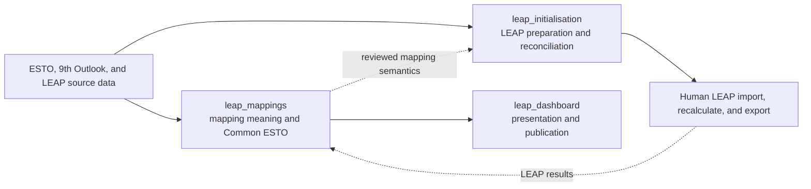
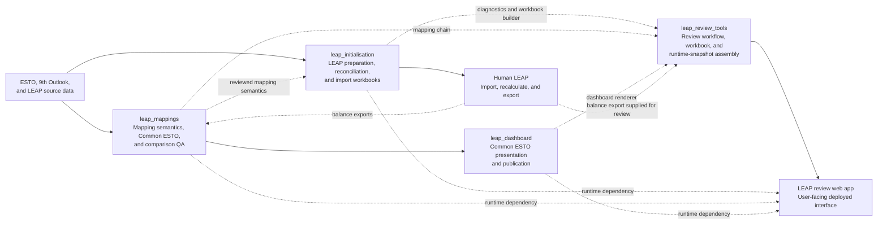

# Start here: LEAP mappings, initialisation, and dashboard

**Status:** canonical Level 0 navigation

**Audience:** new maintainers, analysts, reviewers, and project managers

**Authority:** this page decides where work belongs and which document to read
first. It does not replace the linked technical references.

**Supersedes as the entry point:** `docs/handover/README.md`, which remains the
maintained Level 1 connected-system overview

**Last verified:** 2026-08-17

## The system in 60 seconds

The compact core workflow is useful for a quick orientation:

### Full dependency view

Four repositories and LEAP share the wider workflow. Solid arrows show the
normal order of operations; dotted arrows show reviewed data, runtime, or
deployment dependencies rather than another processing stage:

- `leap_mappings` owns relationships, rollups, comparison scopes, and Common
  ESTO membership.
- `leap_initialisation` owns reconciliation, allocation, LEAP templates,
  import identities, and seed/update workbooks.
- `leap_dashboard` owns page routing, display signs, charts, diagnostics
  presentation, and publication checks. It also provides a visual way to inspect
  mapping diagnostics and compare data across datasets.
- `leap_review_tools` owns the review interface and deployment/runtime assembly;
  it consumes the three source repositories rather than duplicating their
  analysis. The LEAP review web app is its user-facing deployment.

If a problem crosses repositories, establish the mapping or source-data truth
first. Do not repair mapping semantics in dashboard configuration or repair
LEAP import IDs in the mapping workbook.

## Choose the task

| I need to… | Work in | Read first |
|---|---|---|
| understand the whole system | `leap_mappings` | [End-to-end system guide](handover/end_to_end_system_guide.md) |
| edit or review a mapping relationship or rollup | `leap_mappings` | [Mapping pipeline guide](handover/mapping_pipeline_guide.md) |
| understand exact mapping semantics | `leap_mappings` | [Mappings system reference](mappings_system.md) |
| distinguish structural subtotals from numerical additivity | `leap_mappings` | [Hierarchy/subtotal contract](hierarchy_subtotal_contract.md) |
| check a producer/consumer boundary | `leap_mappings` | [Cross-repository data contracts](handover/cross_repository_data_contracts.md) |
| create or update LEAP baseline seeds | `leap_initialisation` | [Supply reconciliation guide](../../leap_initialisation/docs/handover/supply_reconciliation_guide.md) |
| diagnose LEAP paths, duplicate logical keys, or IDs | `leap_initialisation` | [Check registry](../../leap_initialisation/docs/check_registry.md) |
| change dashboard routing, rendering, or signs | `leap_dashboard` | [Dashboard pipeline guide](../../leap_dashboard/docs/handover/dashboard_pipeline_guide.md) |
| inspect mapping or hierarchy diagnostics in the dashboard | `leap_dashboard` | [Mapping diagnostics handover](../../leap_dashboard/docs/handover_mapping_diagnostics.md) |
| decide what to work on next | the owning repository | its current work queue; see [Work queues](#work-queues) |

## Documentation authority

Use the first applicable level. A longer or newer-looking document is not
automatically more authoritative.

| Level | Purpose | Main documents |
|---|---|---|
| **0 — Start** | route the reader and establish ownership | this page |
| **1 — Operate** | explain the runnable workflow and review gates | mapping, supply-reconciliation, and dashboard pipeline guides |
| **2 — Define** | specify semantics, contracts, rules, and validation meaning | `mappings_system.md`, data contracts, check registry, special rules and design decisions |
| **3 — Plan** | record current priorities, owners, dependencies, and open decisions | each repository's controlling work queue |
| **History** | preserve investigation evidence and superseded reasoning | dated audits, diagnosis notes, completed prompts, and `docs/archive/` |

Agent guides add execution safeguards to the reader guides. They do not
override the canonical semantic references.

## Normal operating sequence

1. Confirm which source, workbook, template, code, or configuration changed.
2. Inspect `git status --short --branch` in every repository the task will
   touch. Separate unrelated dirty work before running or committing.
3. Close the editable and generated mapping workbooks in Excel.
4. Run the mapping orchestrator's `generate` stage (or the separate-axis
   refresh directly), any applicable focused maintenance review, and Stages
   1–3 from one reviewed input state. The generation manifest is a hard gate.
5. Review status, manifest, hierarchy, cardinality, preservation, and
   review-only findings. A zero exit code is not the whole release gate.
6. If LEAP preparation changed, generate and validate the initialisation
   workbooks, import them into LEAP, recalculate, and export the next balance.
7. Render dashboards only from a named, reviewed Common ESTO generation.
8. Run dashboard publication-readiness and page-noise checks before publishing.

Mapping Stage 3 is a direct dashboard dependency. Initialisation shares mapping
semantics and source tables but does not consume the dashboard dataset.

## What changed?

| Change | Required follow-up |
|---|---|
| editable axis, accepted pair, generated mapping input, or rollup rule | run separate-axis generation, applicable focused review, and Stages 1–3; review sibling coverage, cardinality, hierarchy, and value preservation |
| LEAP branch, process, variable, scenario, region, or import ID | refresh the affected economy template; validate logical keys and IDs; review affected mappings |
| ESTO or 9th Outlook vintage | rerun the mappings pipeline; rerun affected initialisation sources; rerender dashboards |
| recalculated LEAP results only | export the balance; run the required results-update and comparison stages; no template refresh unless structure changed |
| dashboard page, routing, sign, or display configuration | run focused tests and a representative render; inspect the manifest, page assignment, sign summary, and page-noise report |
| Common ESTO contract generation | verify manifest members, hashes, schema, provenance, and representative legacy/contract equivalence before wider rendering |

## Work queues

The queues serve different purposes:

| Repository | Current planning route | Detailed evidence |
|---|---|---|
| `leap_mappings` | [Mappings work queue](work_queue.md) | the same file contains the dependency plan and dated evidence |
| `leap_initialisation` | [Handover schedule](../../leap_initialisation/docs/handover_work_queue_20260728.md) | [Engineering log](../../leap_initialisation/docs/work_queue.md) preserves decisions and traps and is not priority-ordered |
| `leap_dashboard` | [Dashboard work queue](../../leap_dashboard/docs/work_queue.md) | dated audits and handovers support, but do not replace, that queue |

Before acting on a queue item, verify its status against Git, current artifacts,
and the working tree. Dated counts describe evidence at that time, not permanent
acceptance thresholds.

## Human decisions that cannot be automated

- accepting or rejecting a mapping candidate;
- introducing an ESTO Extended category or allocating historical values to it;
- approving coarse hierarchy mappings, sibling coverage, or intentional
  many-to-many relationships;
- choosing reconciliation caps, surplus treatment, or trade fallback policy;
- approving missing, provisional, duplicate, or `-1` LEAP identities;
- deciding that failed, skipped, stale, or unavailable validation is acceptable;
- approving dashboard publication.

## What not to read first

- `docs/archive/` — preserved history, not active instruction;
- completed prompts — implementation briefs retained as evidence;
- dated documentation audits — useful for provenance and disposition, not the
  current operating sequence;
- old row counts or chart counts — observations, not invariants;
- legacy repositories or compatibility scripts — consult only when a current
  guide explicitly routes there.

## Recommended reading paths

### Analyst or reviewer

1. this page;
2. [connected-system overview](handover/README.md);
3. the relevant reader guide;
4. the canonical rule or contract reference for the decision being reviewed.

### Agent or maintainer

1. this page and the relevant repository `AGENTS.md`;
2. the controlling work queue;
3. the reader guide and its paired agent guide;
4. current Git status, artifacts, and tests before making a change.
